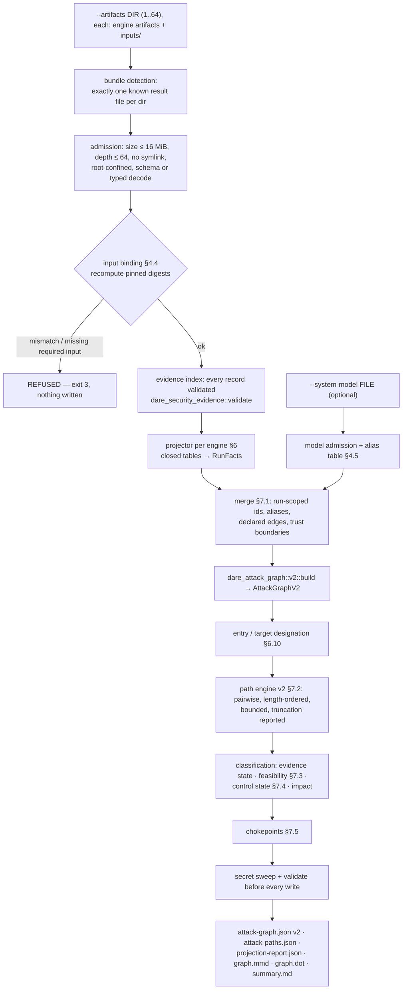

# Cycle 023 — Blueprint: Attack-Path Construction

**Version:** v0.1 | **Date:** 2026-09-28 | **Status:** ARCHITECTURE APPROVED  
**Approval:** APPROVED 2026-09-28 (Product Owner), with the recommended option for BQ-1 to BQ-4 (BQ-3: (a)).  
**Source of truth:** `DESIGN.md` and `APPROVAL.md` (Design approved 2026-09-28)  
**Base:** `main @ 32909ea`

`TASKS.md`, `dare-dag.yaml` and `EXECUTION/` are produced by `/dare-tasks` after this
Blueprint is approved.

> **Four Review items (§13, BQ-1 to BQ-4).** Reading the engines' code showed places
> where the Design's wording needs a precise rule to be implementable:
> - RF-11 would make every path `CONTROL_UNDECIDED`, because structural edges can never
>   carry a guard.
> - Engine-local ids are scenario-local, not engine-wide, so RF-05's engine scope is not
>   strict enough.
> - Most engines never name the agent under test.
> - The CLI exit code for undecided and truncated results is not specified.
>
> None of the four crosses a frozen boundary in `APPROVAL.md`.

---

## 1. Architecture overview

### 1.1 Flow



### 1.2 Architectural decisions

| # | Decision | Justification |
|---|---|---|
| AD-01 | A new crate, `crates/dare-attack-path`, holds the bundle loader, the projectors, the system model, the merge step, path engine v2 and chokepoints (Q1) | The engine crates depend on `dare-adversarial`, which depends on `dare-attack-graph`. Projectors therefore cannot live in `dare-attack-graph`. |
| AD-02 | The **v2 graph contract** (types, schema, validation, renderers) is an additive module, `dare_attack_graph::v2`. It has no engine dependency | `dare-product` (RF-16) and later cycles can read and validate a v2 graph without compiling ten engine crates. This matches the Design header ("additive v2 contract"). v1 code paths are not touched except for the `unwrap()` (§4.10). |
| AD-03 | `dare-attack-path` depends on nine engine crates (014–021 and 013). It does **not** depend on `dare-remote-validation` or `dare-mcp-discovery`. A manifest test forbids `reqwest`, `hyper`, `rmcp`, `tokio` and `axum` in its `[dependencies]` | RNF-04. The 022 result is read as JSON validated against `schemas/remote-validation/v1/result.schema.json`, embedded with `include_str!`. |
| AD-04 | Scenario loading is **re-implemented** in `dare-attack-path::load`. It calls each engine's **public** pieces: `schema::enforce_document_size`, `schema::validate_scenario_document` (or `assert_no_hostile_fields` for 019/020), `serde_json::from_value`, and `validate()` where it exists | Every `load_scenario` is a private `fn` in the CLI (`dare-agent-security-cli/src/*_security.rs`). Moving it into the engines would change engine crates, which is a frozen boundary. A test asserts that, for every lab scenario, the projector's loaded scenario hashes to the digest the engine wrote. |
| AD-05 | Input binding recomputes digests with the **owning engine's own public digest function** over the typed value, never over raw bytes, except where the engine itself hashes raw bytes (019/020 `DocumentRecord.content_digest`) | The engines hash typed, re-serialized values (`dare_adversarial::canonical::digest` sorts keys; 019/020 use plain `serde_json::to_vec`). Hashing raw file bytes would not match. |
| AD-06 | 019 and 020 topology is rebuilt through the engines' public **`StaticAdapter::collect`** over `inputs/evidence/`. The rebuilt bundle's `digest(&…Evidence)` must equal `result.evidence_digest` | This is Q3. `collect` is public in both crates. `evidence_digest` is the only pin that covers the 019 manifest, provenance and attestation files; they have no per-file digest. |
| AD-07 | Node ids are **run-scoped** unless aliased: `node:<type>:<engine>:<run>:<local>`, where `<run>` is the first 12 hex digits of the SHA-256 of the result file bytes. Aliased nodes are `node:<type>:<entity_id>`, and `entity_id` may not contain `:` | Engine-local ids are scenario-local: two tool-security scenarios can both call a tool `search`. The v1 id pattern `^node:[a-z-]+:[A-Za-z0-9._:-]+$` already admits both forms. **BQ-2.** |
| AD-08 | Each run has one **agent-under-test (SUT) node**, local id `sut`. For 015 it is `bindings.agent_principal_id`. For 016 and 017 it is the acting principal. For all other engines it is the literal `sut` | Most engines never name the agent. Without a SUT node, runs cannot be chained, and a system-model alias per SUT is the explicit join. **BQ-2.** |
| AD-09 | Evidence ids on edges: an **OBSERVED** edge cites the evidence records of the trial or outcome that observed it. A **STATICALLY_PROVEN** edge cites `input:<engine>:<hex>`, where `<hex>` is the pinned input digest without the `sha256:` prefix (Q2). An **INFERRED** edge comes only from the system model | Every edge traces to a record, a pinned input or a model line (O-03). The Cycle 008 invariants (`validate_edge_evidence`) are reused unchanged. |
| AD-10 | Path enumeration is **per (entry, target) pair**, in increasing path length. Paths of length L are collected before length L+1, then sorted by `(edges.len(), path.id)` and capped. Path ids use the v1 formula `path:` + `digest_value({"edges","nodes"})` | This gives deterministic "shortest first" results (RF-09) without depending on node-id order. Because the id formula is unchanged, the same path has the same id in v1 and v2, so Cycle 009 plans can still pin it (RF-17). |
| AD-11 | v2 artifacts carry **no wall-clock value**. `generated_at` is omitted | O-06 (byte-identical output). Provenance comes from digests instead. |
| AD-12 | Output safety reuses `dare_attack_graph::validate_safe_label` for every label. Every artifact's bytes then go through a sweep for the same markers the engine CLIs refuse (`DARE-SYNTHETIC-CANARY-`, `sk-live-`, `-----BEGIN`, `ghp_`, `xoxb-`, `eyJhbGci`, and a `bearer ` credential) | RS-02. Labels are built from ids, and an id that fails the label check is replaced by its hashed form (§4.3). |

---

## 2. Fixed technical stack

| Item | Version / choice |
|---|---|
| Rust | edition 2021, MSRV 1.88 (workspace) |
| `serde`, `serde_json`, `jsonschema`, `sha2`, `thiserror` | workspace versions (`thiserror = "2.0"` as in `dare-attack-graph`) |
| Engine crates (path deps) | `dare-prompt-injection`, `dare-tool-security`, `dare-identity-security`, `dare-memory-security`, `dare-rag-security`, `dare-mcp-auth-security`, `dare-supply-chain-security`, `dare-a2a-security`, `dare-multi-turn-security` |
| Other path deps | `dare-attack-graph`, `dare-security-evidence`, `dare-coverage` (registries), `dare-adversarial` (`canonical::digest_value` only) |
| Dev-dependencies | `tempfile = "3.14"` (already used by `dare-attack-graph`) |
| New third-party dependencies | **none** |

---

## 3. Folder structure

```text
crates/dare-attack-graph/
  src/path.rs                      # v1: unwrap() removed, output unchanged (§4.10)
  src/v2/mod.rs                    # pub use of the v2 contract
  src/v2/model.rs                  # AttackGraphV2 and the types in §4.7
  src/v2/validate.rs               # validate_graph_v2 (schema + invariants)
  src/v2/render.rs                 # to_mermaid_v2, to_dot_v2 (same escaping as v1)
  tests/v1_unchanged.rs            # byte-identical v1 outputs for the 5 fixtures
schemas/attack-graph/v2/attack-graph.schema.json
schemas/attack-graph/v2/attack-paths.schema.json
schemas/attack-graph/v2/projection-report.schema.json
schemas/attack-path/v1/system-model.schema.json
crates/dare-attack-path/
  Cargo.toml
  src/lib.rs                       # pub API (§5.2)
  src/error.rs                     # AttackPathError (§4.1)
  src/limits.rs                    # §4.2
  src/admit.rs                     # file admission, depth check, symlink refusal
  src/ids.rs                       # node-id construction and hashing (§4.3)
  src/bundle.rs                    # bundle detection + input binding (§4.4)
  src/evidence_index.rs            # evidence file → validated id map, property key table
  src/model.rs                     # SystemModel + resolution (§4.5)
  src/facts.rs                     # RunFacts, FactNode, FactEdge, FactGuard (§4.6)
  src/project/mod.rs               # dispatch by EngineSlug
  src/project/{tool,identity,memory,rag,mcp_auth,supply_chain,a2a,prompt_injection,multi_turn,remote}.rs
  src/guard_table.rs               # closed property → guarded-edge table (§6.11)
  src/merge.rs                     # §7.1
  src/designate.rs                 # entry / target defaults + model overrides (§6.10)
  src/enumerate.rs                 # path engine v2 (§7.2)
  src/continuity.rs                # §7.3
  src/control.rs                   # §7.4
  src/chokepoint.rs                # §7.5
  src/sweep.rs                     # artifact secret sweep (AD-12)
  src/run.rs                       # construct() end to end (§5.2)
  tests/manifest.rs                # no network deps; no engine depends on this crate
  tests/binding.rs                 # §8.3 refusal corpus
  tests/projection_tables.rs       # one test per row of §6
  tests/continuity.rs, tests/control.rs, tests/enumerate.rs, tests/chokepoint.rs
  tests/scale.rs                   # O-09
crates/dare-agent-security-cli/
  src/attack_paths.rs              # `validate attack-paths`
  src/args.rs                      # new subcommand
  tests/attack_path_lab.rs         # ATTACK-PATH-LAB (§8.1) through the real binary
  tests/fixtures/attack-path-lab/APL-NNN/{scenarios/,evidence/,traces/,system-model.json,expected.json}
.github/workflows/ci.yml           # new job `attack-path-2026`
DARE/cycles/023-attack-path-construction/{BASELINE,PROOF,REGRESSION}.md
book/{en,pt}/src/…                 # attack-path chapter
```

---

## 4. Data model

### 4.1 Errors (`error.rs`)

```rust
#[derive(Debug, thiserror::Error)]
pub enum AttackPathError {
    /// Exit 3. Nothing written.
    #[error("refused: {0}")] Refused(Refusal),
    /// Exit 1.
    #[error("internal: {0}")] Internal(String),
}
#[derive(Debug, Clone, PartialEq, Eq)]
pub enum Refusal {
    NoArtifacts, TooManyArtifacts { given: usize },
    UnknownBundle { index: usize },            // zero or several known result files
    FileTooLarge { index: usize, file: &'static str }, TooDeep { index: usize },
    Symlink { index: usize }, PathEscape { index: usize },
    InvalidDocument { index: usize, file: &'static str, reason: String },
    MissingInput { index: usize, input: &'static str },
    DigestMismatch { index: usize, input: &'static str },
    InvalidEvidence { index: usize, evidence_id: String },
    UnknownEvidenceId { index: usize, evidence_id: String },
    DuplicateRun { first: usize, second: usize },   // same result bytes twice
    Model(ModelRefusal),
    BoundAboveMaximum { bound: &'static str, given: u64, max: u64 },
    UnsafeOutputDir,
}
#[derive(Debug, Clone, PartialEq, Eq)]
pub enum ModelRefusal {
    Invalid(String), ConflictingAlias { engine: String, local_id: String },
    UnknownEntity(String), TypeClash { entity_id: String }, DuplicateEntity(String),
    DeclaredEdgeWithoutRationale(usize), UnknownDesignationTarget(String),
    UnusableEntityId(String), OverLimit(&'static str),
}
```

- Error messages never echo a file's content, only the field name.
- A digest mismatch names the input kind, never the values.

### 4.2 Limits (`limits.rs`)

| Constant | Value | Lowerable by flag |
|---|---|---|
| `MAX_ARTIFACT_DIRS` | 64 | no |
| `MAX_FILE_BYTES` | 16 MiB (16 777 216) | no |
| `MAX_JSON_DEPTH` | 64 | no |
| `MAX_MODEL_BYTES` | 4 MiB | no |
| `MAX_MODEL_ENTITIES` / `ALIASES` / `DECLARED_EDGES` / `BOUNDARIES` | 2 000 / 10 000 / 5 000 / 64 | no |
| `MAX_NODES` / `MAX_EDGES` | 10 000 / 50 000 (v1 schema) | no |
| `MAX_PATH_EDGES` | 12 | `--max-path-edges` |
| `MAX_PATHS` | 10 000 | `--max-paths` |
| `MAX_PATHS_PER_PAIR` | 64 | `--max-paths-per-pair` |
| `MAX_STEPS` | 5 000 000 | no |
| `MAX_TRUNCATED_PAIRS_LISTED` | 1 000 (the count is always exact) | no |

- Defaults equal the maxima, except `--max-path-edges`, whose default is 8.
- A flag above a maximum is `Refusal::BoundAboveMaximum`, and so is a flag set to 0.

### 4.3 Identifiers (`ids.rs`)

- `EngineSlug` (closed enum, kebab-case): `prompt-injection`, `tool`, `identity`,
  `memory`, `rag`, `mcp-auth`, `supply-chain`, `a2a`, `multi-turn`, `remote`.
- `RunTag`: the first 12 lowercase hex digits of `sha256(result file bytes)`.
- `local_token(raw)`:
  - `raw` is returned unchanged when it matches `^[A-Za-z0-9._-]{1,96}$`.
  - Otherwise the token is `x-` followed by the first 32 hex digits of `sha256(raw)`.
  - `:` is never allowed in a token. That keeps the two node-id forms unambiguous.
- `scoped_node_id(t, engine, run, raw)`: `format!("node:{}:{}:{}:{}", t.slug(), engine, run, local_token(raw))`.
- `entity_node_id(t, entity_id)`: `format!("node:{}:{entity_id}", t.slug())`.
  - `entity_id` must match `^[a-z0-9][a-z0-9._-]{0,95}$`, or the model is refused with `UnusableEntityId`.
- `display_name(raw, t, token)`:
  - If `validate_safe_label(raw)` passes, the name is `raw` truncated to 160 characters.
  - Otherwise it is `format!("{} {}", t.slug(), token)`. The unsafe raw text is never emitted.
- `authority.principal` and `authority.credential` hold **node ids** after projection
  and resolution (§7.1).
  - A principal string that is not a projected node becomes `ext:<local_token>`.
  - `authority.credential` keeps the v1 rule that it must be a `node:credential:` id.

### 4.4 Artifact bundle and input binding (`bundle.rs`)

Each `--artifacts DIR` must contain **exactly one** of these result files. Any other
count is `UnknownBundle`.

| Result file | Engine | Evidence file (required) | Required inputs under `DIR/inputs/` | Binding check |
|---|---|---|---|---|
| `tool-security-result.json` | tool | `tool-security-evidence.json` | `scenario.json` | `dare_tool_security::canonical::scenario_digest(&s) == result.scenario_digest`, and `tool_surface_digest(&s.tool_surface) == result.surface_digest` |
| `identity-security-result.json` | identity | `identity-security-evidence.json` | `scenario.json` | `dare_identity_security::digest(&s) == result.scenario_digest`, and `principal_set_digest`, `delegation_chain_digest` and `resource_context_digest` equal the result's values when they are `Some` |
| `memory-security-result.json` | memory | `memory-security-evidence.json` | `scenario.json` | `dare_memory_security::digest(&s) == result.scenario_digest`, and `canonical::store_digest(&s.store) == result.store_digest` |
| `rag-security-result.json` | rag | `rag-security-evidence.json` | `scenario.json` | `dare_rag_security::digest(&s) == result.scenario_digest`, and `canonical::store_digest(&s.store) == result.store_digest` |
| `mcp-auth-security-result.json` | mcp-auth | `mcp-auth-security-evidence.json` | `scenario.json` | `dare_mcp_auth_security::canonical::digest(&s) == result.scenario_digest` |
| `supply-chain-security-result.json` | supply-chain | `supply-chain-security-evidence.json` | `scenario.json` **or** a built-in id (below), plus `evidence/` | scenario digest; each `documents[].content_digest == digest_bytes(file bytes)`; `canonical::digest(&StaticAdapter::new(inputs/evidence).collect(&s, &mut AdmissionLedger::new())?) == result.evidence_digest` |
| `a2a-result.json` | a2a | `a2a-evidence.json` | `scenario.json` or a built-in id, plus `evidence/` | scenario digest; each `documents[].content_digest`; `canonical::digest(&collected) == result.evidence_digest` |
| `prompt-injection-result.json` | prompt-injection | `prompt-injection-evidence.json` | none (result-only projector) | none; `scenario_digest` is recorded in provenance |
| `multi-turn-result.json` | multi-turn | `multi-turn-evidence.json` | `multi-turn-conversations.json` (a sibling artifact, not an input) | every `conversations[i].final_chain_digest` equals the digest of the last turn's `chain_digest` in `multi-turn-conversations.json` |
| `remote-result.json` | remote | `remote-evidence.json` | optional `inputs/run-<i>/scenario.json` for an MCP-auth run | schema-valid against the embedded 022 result schema; an optional scenario must match `runs[i].scenario_digest` |

**Rules.**
1. **Built-in scenarios.** When `inputs/scenario.json` is absent, `result.scenario_id`
   is resolved through `dare_supply_chain_security::corpus::{entry_by_id, scenario_for}` or
   `dare_a2a_security::corpus::{entry_by_id, scenario_for}`. The rebuilt scenario must still
   hash to `result.scenario_digest`.
2. **Replay mode (019 and 020).** In place of `evidence/`, the bundle holds
   `inputs/capture.json`. The capture's `evidence` digest must equal
   `result.evidence_digest`.
3. **Admission** of every file follows the same sequence:
   1. Refuse it if `symlink_metadata` says it is a symlink.
   2. Canonicalize the path and require it to stay under `DIR`.
   3. Check the size.
   4. Parse it with `serde_json::from_slice`.
   5. Check the depth (≤ 64).
   6. Run the engine's own schema, hostile-field and typed validation.
4. **Duplicate results.** The same result bytes supplied twice is `DuplicateRun`.
5. **Evidence index** (`evidence_index.rs`):
   - Every record in the evidence file is decoded as `SecurityEvidence` and validated
     with `dare_security_evidence::validate`. A failure is `InvalidEvidence`.
   - The property is read from `extensions["dare.<engine-ns>.v1"]`, using a closed key
     table: `property_id` for prompt-injection, tool, identity, memory and rag;
     `property` for supply-chain, a2a, mcp-auth and multi-turn.
   - Every evidence id that a result lists (`result.evidence_ids` where it exists) must
     be present in the file. Otherwise the refusal is `UnknownEvidenceId`.

### 4.5 System model (`schemas/attack-path/v1/system-model.schema.json`, `model.rs`)

```rust
#[serde(deny_unknown_fields)] pub struct SystemModel {
    pub schema_version: String,            // const "1"
    pub model_id: String,                  // ^[a-z0-9][a-z0-9._-]{0,95}$
    pub target_id: String, pub target_version: String,   // 1..160, safe label
    pub entities: Vec<Entity>, #[serde(default)] pub aliases: Vec<Alias>,
    #[serde(default)] pub entry_points: Vec<Designation>, #[serde(default)] pub targets: Vec<Designation>,
    #[serde(default)] pub trust_boundaries: Vec<TrustBoundary>,
    #[serde(default)] pub declared_edges: Vec<DeclaredEdge>,
}
pub struct Entity { pub entity_id: String, #[serde(rename = "type")] pub node_type: NodeType,
                    pub display_name: String, #[serde(default)] pub security: NodeSecurity }
pub struct Alias { pub engine: EngineSlug, pub local_id: String,
                   pub run: Option<String>,        // ^[0-9a-f]{12}$; absent = every run of that engine
                   pub entity_id: String }
pub struct Designation { pub entity_id: Option<String>, pub node_id: Option<String>,   // exactly one
                         pub class: DesignationClass, #[serde(default)] pub exclude: bool }
pub struct TrustBoundary { pub boundary_id: String, pub entity_ids: Vec<String> }       // 1..=500 ids
pub struct DeclaredEdge { #[serde(rename = "type")] pub edge_type: EdgeType,
                          pub source: String, pub target: String,     // entity ids
                          #[serde(default)] pub authority: AuthorityContext,
                          pub status: DeclaredStatus,                 // INFERRED | NOT_TESTED
                          pub rationale: Option<String>, pub reason: Option<String> }
```

**Resolution rules**, applied in this order. Any violation refuses the model:
1. The model is admitted by size, depth and schema. `entity_id`s are unique.
2. The entity for every alias exists.
3. Every alias key is unique:
   - `(engine, local_id, run)` must be unique, and so must `(engine, local_id)` when
     `run` is absent;
   - one local id mapped to two entities is `ConflictingAlias`.
4. When an alias matches a projected node, the node's type must equal the entity's type.
   A mismatch is `TypeClash`. The model author picks one type; there is no implicit
   AGENT/IDENTITY equivalence.
5. Designations:
   - a designation's `entity_id` or `node_id` must resolve to a node in the merged graph,
     or the refusal is `UnknownDesignationTarget`;
   - `exclude: true` removes a default designation of the same class.
6. Declared edges:
   - an `INFERRED` edge needs a non-empty `rationale`, or the refusal is
     `DeclaredEdgeWithoutRationale`;
   - a `NOT_TESTED` edge needs a non-empty `reason`;
   - `source_facts` is set to `["system-model:<model_digest_hex>#/declared_edges/<i>"]`.
7. Aliases that match no projected node are **not** an error. They are listed in
   `projection-report.json` under `aliases_unused`.

### 4.6 Run facts (`facts.rs`), the output of every projector

```rust
pub struct RunFacts { pub artifact_index: u32, pub engine: EngineSlug, pub run: RunTag,
    pub mode: String, pub synthetic: bool, pub dynamic_authorized: bool,
    pub result_digest: String, pub evidence_digest: String, pub input_digests: Vec<String>,
    pub nodes: Vec<FactNode>, pub edges: Vec<FactEdge>, pub designations: Vec<FactDesignation>,
    pub unprojected: BTreeMap<String, u32> }        // kind → count, e.g. "RelationType::SIGNED_BY"
pub struct FactNode { pub local_id: String, pub node_type: NodeType, pub raw_label: String,
    pub security: NodeSecurity, pub original_kind: String, pub locator: String }  // JSON pointer
pub struct FactEdge { pub edge_type: EdgeType, pub source: String, pub target: String,  // local ids
    pub authority: FactAuthority, pub evidence: EdgeEvidence, pub guards: Vec<FactGuard>,
    pub authority_mutation: bool, pub locator: String }
pub struct FactGuard { pub property: String, pub verdict: Verdict, pub evidence_ids: Vec<String>,
    pub scope: GuardScope /* RUN | ENTITY */ }
pub struct FactDesignation { pub local_id: String, pub class: DesignationClass, pub is_entry: bool }
```

`FactAuthority` is `AuthorityContext` with `principal` and `credential` still holding
local ids. `merge` rewrites them to node ids (§4.3).

### 4.7 v2 graph contract (`dare_attack_graph::v2`, `schemas/attack-graph/v2/*.json`)

```rust
pub const SCHEMA_ID_V2: &str = "https://darelabs.tech/schemas/attack-graph/v2/attack-graph.schema.json";
pub struct AttackGraphV2 { pub schema: SchemaRef /* version "2.0.0" */, pub id: String /* graph:<64hex> */,
    pub target_id: String, pub target_version: String, pub sources: SourcesV2, pub engine: GraphEngine,
    pub nodes: Vec<NodeV2>, pub edges: Vec<EdgeV2>,
    pub entry_points: Vec<DesignationV2>, pub targets: Vec<DesignationV2> }
pub struct SourcesV2 { pub model_digest: Option<String>, pub artifacts: Vec<ArtifactSource> }
pub struct ArtifactSource { pub index: u32, pub engine: String, pub run: String, pub mode: String,
    pub synthetic: bool, pub dynamic_authorized: bool, pub result_digest: String,
    pub evidence_digest: String, pub input_digests: Vec<String> }
pub struct NodeV2 { pub id: String, #[serde(rename="type")] pub node_type: NodeType,
    pub display_name: String, pub security: NodeSecurity, pub provenance: Vec<Provenance> }
pub struct Provenance { pub artifact_index: Option<u32>,   // None = system model
    pub original_kind: String, pub locator: String }
pub struct EdgeV2 { pub id: String, #[serde(rename="type")] pub edge_type: EdgeType,
    pub source: String, pub target: String, pub authority: AuthorityContext, pub evidence: EdgeEvidence,
    pub guards: Vec<Guard>, pub authority_mutation: bool,
    pub crosses_trust_boundary: Vec<String>, pub provenance: Vec<Provenance> }
pub struct Guard { pub property: String, pub verdict: String, pub evidence_ids: Vec<String>,
    pub scope: String, pub artifact_index: u32 }
pub struct DesignationV2 { pub node: String, pub class: String, pub origin: String /* DEFAULT | MODEL */ }
pub struct PathV2 { pub id: String, pub nodes: Vec<String>, pub edges: Vec<String>,
    pub status: PathStatus, pub feasibility: String, pub discontinuity_at: Option<u32>,
    pub control_state: String, pub failed_guards: Vec<GuardRef>, pub undecided_edges: Vec<String>,
    pub entry: String, pub entry_class: String, pub target: String, pub target_class: String,
    pub impact_factors: ImpactFactorsV2 }
pub struct ImpactFactorsV2 { #[serde(flatten)] pub v1: ImpactFactors, pub crosses_trust_boundary: bool }
pub struct AttackPathsDoc { pub schema_version: String /* "2" */, pub graph_id: String,
    pub paths: Vec<PathV2>, pub discontinuous_paths: Vec<PathV2>,
    pub chokepoints: Vec<Chokepoint>, pub enumeration: Enumeration }
pub struct Enumeration { pub max_path_edges: u32, pub max_paths: u32, pub max_paths_per_pair: u32,
    pub max_steps: u64, pub steps_used: u64, pub truncated: bool, pub stopped_by: Vec<String>,
    pub pairs_total: u32, pub pairs_exhausted: u32, pub pairs_truncated_count: u32,
    pub pairs_truncated: Vec<PairRef> }
pub struct Chokepoint { pub target: String, pub edge: String, pub properties: Vec<String>,
    pub failed_paths: u32, pub partial: bool }
```

**Invariants enforced by `validate_graph_v2`, in addition to the schema:**
1. The v1 edge-evidence invariants hold.
2. `edge.id == build_edge_id(source, type, target, authority)`.
3. Every node referenced by an edge, path or designation exists.
4. Every `Guard.verdict` is one of `PASS`, `FAIL`, `INCONCLUSIVE` or `ERROR`.
5. Every `Provenance.artifact_index` refers to an entry in `sources.artifacts`.
6. `path.control_state` equals the value recomputed by §7.4, so a document cannot claim
   a better state than its guards support.
7. All lists are sorted by id.

**Graph id.** `graph.id = "graph:" + digest_value(graph with id cleared)`, using the v1
canonicalization.

### 4.8 Designation classes

- `DesignationClass` for entries: `UNTRUSTED_INPUT`, `EXTERNAL_CONTENT`,
  `RETRIEVED_DOCUMENT`, `MEMORY_WRITE`, `PEER_AGENT`, `SUPPLY_CHAIN_COMPONENT`,
  `LOW_PRIVILEGE_PRINCIPAL`.
- For targets: `SENSITIVE_RESOURCE`, `PRIVILEGED_CREDENTIAL`, `DESTRUCTIVE_CAPABILITY`,
  `CROSS_TENANT_RESOURCE`, `EXTERNAL_PUBLICATION`.
- Each class is valid on one side only. An entry class used as a target is a schema error.

### 4.9 Merge of identical edges

Two facts that produce the same edge id are merged:
- **Evidence status:** the stronger of the two, with `OBSERVED > STATICALLY_PROVEN > INFERRED > NOT_TESTED`.
- **`evidence_ids`:** the sorted, de-duplicated union.
- **`rationale`, `source_facts` and `reason`:** taken from the entry with the lowest
  `(artifact_index, locator)`, and only if the merged status still needs them.
- **Guards:** the union, keyed by `(property, artifact_index, scope)`.
- **`authority_mutation`:** the logical OR.
- **Provenance:** the union.

### 4.10 v1 correction (`dare-attack-graph/src/path.rs`)

```rust
fn make_path(graph: &AttackGraph, nodes: &[String], edge_ids: &[String]) -> Result<Path> {
    let by_id: BTreeMap<&str, &Edge> = graph.edges.iter().map(|e| (e.id.as_str(), e)).collect();
    let edges = edge_ids.iter()
        .map(|id| by_id.get(id.as_str()).copied()
            .ok_or_else(|| GraphError::Invalid("path references missing edge".into())))
        .collect::<Result<Vec<_>>>()?;
    …   // rest unchanged
}
```

- **Output must not change.** Phase 0 records the SHA-256 of `attack-graph.json` and
  `paths.json` for each of the five `fixtures/attack-graph/*.json`, using the CLI at
  `32909ea`. `tests/v1_unchanged.rs` asserts those digests.
- **Items 2–4 of Design §4.9** (silent truncation, sink-only emission, O(n) lookups) are
  **not** changed in v1 (Q5).

---

## 5. Contracts

### 5.1 CLI: `dare-agent-security validate attack-paths`

| Flag | Type | Rule |
|---|---|---|
| `--artifacts <DIR>` | path, repeatable 1..64 | required; each follows the §4.4 bundle contract |
| `--system-model <FILE>` | path | optional; §4.5 |
| `--output-dir <DIR>` | path | required; `ci_output::validate_output_dir` |
| `--max-path-edges <N>` | 1..=12 | default 8 |
| `--max-paths <N>` | 1..=10000 | default 10000 |
| `--max-paths-per-pair <N>` | 1..=64 | default 64 |
| `--json` | flag | prints `attack-paths.json` to stdout |

There is no flag for a URL, an engine command, a shell, or a network target.
`validate attack-graph --facts` is unchanged.

**Files written**, in order. Each one is validated and swept before it is written, and
nothing is written if any check fails:
1. `projection-report.json`
2. `attack-graph.json` (v2)
3. `attack-paths.json`
4. `graph.mmd`
5. `graph.dot`
6. `summary.md`

**Exit codes** (existing constants; **BQ-4**):

| Code | Condition |
|---|---|
| 0 | Every feasible path is `CONTROLS_HELD` (or there are no paths), and enumeration was not truncated |
| 1 | Internal error |
| 2 | At least one feasible path is `CONTROL_FAILED` or `CONTROL_UNDECIDED`, or enumeration was truncated |
| 3 | Any `Refusal` (§4.1). Nothing is written |

**Example:**

```bash
dare-agent-security validate attack-paths \
  --artifacts out/rag --artifacts out/tool --artifacts out/identity \
  --system-model model/support-agent.json --output-dir out/paths
# stdout: 3 feasible paths (1 CONTROL_FAILED, 2 CONTROL_UNDECIDED), exit 2
```

### 5.2 Library (`dare-attack-path`)

```rust
pub struct ConstructOptions { pub max_path_edges: u32, pub max_paths: u32, pub max_paths_per_pair: u32 }
pub struct Construction { pub graph: AttackGraphV2, pub paths: AttackPathsDoc, pub report: ProjectionReport }
pub fn load_bundle(index: u32, dir: &Path) -> Result<LoadedBundle, AttackPathError>;
pub fn project(bundle: &LoadedBundle) -> Result<RunFacts, AttackPathError>;
pub fn load_model(path: &Path) -> Result<SystemModel, AttackPathError>;
pub fn construct(dirs: &[PathBuf], model: Option<&Path>, opts: &ConstructOptions)
    -> Result<Construction, AttackPathError>;
```

- **Precondition:** `opts` values are within §4.2. Otherwise `construct` returns
  `BoundAboveMaximum`.
- **Postconditions:**
  - `validate_graph_v2(&c.graph)` holds;
  - every path id appears once across `paths` and `discontinuous_paths`;
  - calling `construct` twice on the same inputs gives byte-identical serializations
    (O-06).
- **I/O and concurrency:** `construct` performs only file reads under the given
  directories. It is single-threaded, and it has no global state.

---

## 6. Projection tables

**Conventions:**
- **Local ids.** "SUT" is the run's agent-under-test node (AD-08). `T(x)` means the
  local id taken from field `x`.
- **Evidence ids.**
  - *OBS(i)* is the evidence id for trial `i`: `result.evidence_ids[i]` for prompt-injection,
    tool, identity, memory, rag and mcp-auth.
  - *OBS(run)* is every record id in the evidence file, sorted. It is used for
    supply-chain, a2a and multi-turn, which emit one record per outcome.
  - *IN* is `input:<engine>:<scenario_digest hex>`.
  - *DOC(d)* is `input:<engine>:<document content digest hex>`.
- **Guards.** "Guard" names the properties attached to the edge, with the rule in §6.11.
- **Unprojected kinds.** A kind not listed in a table is counted in `unprojected` under
  its Rust type name.

### 6.1 Tool (014)

| Source (field / event) | Node(s) | Edge | Evidence |
|---|---|---|---|
| `scenario.tool_surface` | `MCP_SERVER` T(surface_id) | — | — |
| each `ToolEntry` | `TOOL` T(tool_id); `destructive` if `declared_operation_class ∈ {DELETE, PAYMENT, PRIVILEGE_CHANGE}` or `annotations.destructive_hint == Some(true)`; `sensitive` if `declared_sensitivity == HIGH` | server `CAN_REACH` tool; SUT `CAN_INVOKE` tool | IN |
| `ToolRequested{tool_id, dispatched: true}` in trial i | — | SUT `CALLS` tool | OBS(i) |
| `ToolOutputObserved{tool_id}` in trial i | `DATA` `output.<tool_id>` | tool `TRANSFERS_TO` output; output `TRANSFERS_TO` SUT | OBS(i) |

- **Guards:**
  - `AGENT.TOOL.AUTHORIZATION_BOUNDARY`, `…SELECTION_INTENT_BINDING`, `…ARGUMENT_INTEGRITY`
    and `…CHAIN_BOUNDARY` guard SUT `CALLS` tool.
  - `AGENT.TOOL.METADATA_TRUST_BOUNDARY` guards SUT `CAN_INVOKE` tool.
  - `AGENT.TOOL.OUTPUT_TRUST_BOUNDARY` guards output `TRANSFERS_TO` SUT.
- **Entity-scope key:** `ToolViolation.tool_id`.

### 6.2 Identity (015)

| Source | Node(s) | Edge | Evidence |
|---|---|---|---|
| each `Principal` | `HUMAN` (kind HUMAN), `AGENT` (AGENT), `IDENTITY` (WORKLOAD, SERVICE), T(id); `tenant` from `tenant_id` | — | — |
| `scenario.delegation.edges[]` | — | delegator `DELEGATES_TO` delegatee, authority `{principal: delegated_subject_id or delegator, delegated: true, scopes: [purpose_id, audience]}` | IN; OBS(i) if a `DelegationEdge` event with the same `edge_id` occurs in trial i |
| `credential_contexts[]` | `CREDENTIAL` T(credential_context_id); `privileged` if the owner's kind ∈ {SERVICE, WORKLOAD} | owner `AUTHENTICATES_AS` credential | IN |
| `CredentialContext` event in trial i | — | effective principal `USES_CREDENTIAL` credential | OBS(i) |
| `scenario.resource` | `RESOURCE` T(resource_id), `tenant`; `sensitive` if `classification == SYNTHETIC_RESTRICTED`; `TENANT` T(tenant_id) | resource `BELONGS_TO_TENANT` tenant; credential `CAN_REACH` resource when the resource tenant ∈ `tenant_labels` | IN |
| `FinalOperation{operation, dispatched: true}` in trial i | `TOOL` T(tool_id) if present | subject `CALLS` tool (if a tool); subject `CAN_REACH` resource, authority `{principal: subject_id, tenant: operation.tenant_id}` | OBS(i) |

- **Guards:**
  - `AGENT.IDENTITY.{DELEGATION_INTEGRITY, DELEGATION_SCOPE_BOUNDARY, PRIVILEGE_AMPLIFICATION}`
    guard `DELEGATES_TO`.
  - `…PRINCIPAL_BINDING` and `…AUTHORIZATION_EXECUTION_BINDING` guard `CALLS` and
    subject `CAN_REACH` resource.
  - `…TENANT_RESOURCE_BOUNDARY` guards every `CAN_REACH` to the resource.
- **`authority_mutation`** is `true` on subject `CAN_REACH` resource when the run's
  `AUTHORIZATION_EXECUTION_BINDING` or `PRINCIPAL_BINDING` guard is FAIL.
- **Entity-scope key:** `IdentityViolation.principal_id`.

### 6.3 Memory (016)

| Source | Node(s) | Edge | Evidence |
|---|---|---|---|
| `context.principals[]` | `HUMAN` / `AGENT` / `IDENTITY` by `PrincipalKind` (shared with 015) | — | — |
| `store.items[]` | `DATA` T(memory_id), `tenant` | owner `WRITES` item | IN |
| `MemoryWriteObserved` in trial i | — | writer `WRITES` item | OBS(i) |
| `MemoryRecallObserved{requester, items}` in trial i | — | requester `READS` item; item `TRANSFERS_TO` requester | OBS(i) |
| `ActionIntentObserved{tool_id: Some, performed: true}` in trial i | `TOOL` | SUT `CALLS` tool; and, when a `MemoryInfluenceObserved{changed: true, target ∈ {TOOL_SELECTION, TOOL_ARGUMENT}}` is in the same trial, item `TRANSFERS_TO` tool | OBS(i) |

- **Guards:**
  - `AGENT.MEMORY.{WRITE_TRUST_BOUNDARY, PROVENANCE_INTEGRITY}` guard `WRITES`.
  - `…{RECALL_AUTHORITY_BOUNDARY, TENANT_BOUNDARY, LIFECYCLE_VALIDITY}` guard `READS`.
  - `…CONTEXT_INTEGRITY` guards item `TRANSFERS_TO` (requester or tool) and SUT `CALLS` tool.
- **Entity-scope key:** `MemoryViolation.memory_id`.

### 6.4 RAG (017)

| Source | Node(s) | Edge | Evidence |
|---|---|---|---|
| `store.documents[]` | `DATA` T(document_id), `tenant`; `sensitive` if `classification ∈ {CONFIDENTIAL, RESTRICTED}`; `TENANT` | document `BELONGS_TO_TENANT` tenant | IN |
| `DocumentContext{document}` or `RetrievedChunk{bound_document_id}` in trial i | — | SUT `READS` document, authority `{principal: acting_principal_id, tenant: context.tenant_id}`; document `TRANSFERS_TO` SUT | OBS(i) |

- **Guards:**
  - `AGENT.RAG.{RETRIEVAL_AUTHORIZATION_BOUNDARY, TENANT_DOCUMENT_ISOLATION,
    PROTECTED_DOCUMENT_NONDISCLOSURE, RESULT_SET_INTEGRITY}` guard `READS`.
  - `…{CONTENT_TRUST_BOUNDARY, PROVENANCE_INTEGRITY}` guard `TRANSFERS_TO`.
- **Entity-scope key:** `RagViolation.document_id`.
- **Collections** are recorded only in the provenance `original_kind`.

### 6.5 MCP Auth (018)

| Source | Node(s) | Edge | Evidence |
|---|---|---|---|
| `protected_resource.expected_resource` | `MCP_SERVER` T(uri) | — | — |
| `identity_metadata.acting_principal` | `IDENTITY` T(principal_id), `tenant` | — | — |
| `credential_flow.credentials.inbound` | `CREDENTIAL` T(credential_id) | principal `USES_CREDENTIAL` inbound; inbound `CAN_REACH` server | IN; OBS(i) when a `CREDENTIAL_FLOW_CONTEXT` event occurs in trial i |
| `credential_flow.credentials.upstream` | `CREDENTIAL`, `privileged: true` | server `USES_CREDENTIAL` upstream, authority `{service_identity: server}` | IN / OBS(i) |
| `authorization_flow` selected server | `POLICY_DECISION_POINT` T(issuer) | server `AUTHORIZED_BY` PDP | IN |
| `final_operation.{authorized,performed}_resource` | `RESOURCE` T(uri) | upstream `CAN_REACH` performed resource; performed principal `CAN_REACH` performed resource, with `authority_mutation = authorized_* != performed_*` over principal, tenant and resource | IN / OBS(i) |

- **Guards:**
  - `MCP.AUTH.TOKEN_AUDIENCE_RESOURCE_BINDING`, `…PROTOCOL_BINDING`,
    `…PKCE_REDIRECT_STATE_INTEGRITY`, `…SCOPE_STEP_UP_INTEGRITY` and
    `…CLIENT_REGISTRATION_TRUST` guard inbound `CAN_REACH` server.
  - `MCP.AUTH.CREDENTIAL_SEPARATION` guards server `USES_CREDENTIAL` upstream and
    upstream `CAN_REACH` resource.
  - `MCP.AUTH.{AUTHORIZATION_SERVER_BINDING, PROTECTED_RESOURCE_METADATA}` guard
    `AUTHORIZED_BY`.
  - `MCP.AUTH.FINAL_OPERATION_BINDING` guards principal `CAN_REACH` resource.
  - `MCP.IDENTITY.SELF_REPORTED_METADATA_BOUNDARY` guards principal `USES_CREDENTIAL`
    inbound.
- **Entity-scope key:** none; every 018 guard is RUN scope.
- **URIs** are `SyntheticUri` ids. `local_token` hashes any id that contains characters
  outside the token set.

### 6.6 Supply chain (019), over `StaticAdapter::collect` output

| `ComponentType` | Node type |
|---|---|
| `AGENT`, `EXTERNAL_AGENT` | `AGENT` |
| `TOOL` | `TOOL` |
| `MCP_SERVER` | `MCP_SERVER` |
| `MODEL`, `EMBEDDING_MODEL`, `SERVICE_API` | `DOWNSTREAM_SERVICE` |
| `DATASET`, `PROMPT_POLICY_ASSET` | `DATA` |
| `FRAMEWORK`, `PACKAGE`, `CONTAINER_IMAGE`, `SKILL_PLUGIN` | `CAPABILITY` |
| `GUARDRAIL` | `POLICY_ENFORCEMENT_POINT` |

Edges come from `Relationship{source_id, target_id, relation}` (A = source, B = target).
Every one is STATICALLY_PROVEN, citing DOC(d) for each BOM document and IN for the
manifest:

| `RelationType` | Graph edge | Meaning |
|---|---|---|
| `DEPENDS_ON`, `USES`, `LOADS`, `BUILT_FROM`, `EMBEDS_WITH` | B `TRANSFERS_TO` A | code or data of B flows into A |
| `TRAINED_FROM`, `FINE_TUNED_FROM` | B `TRANSFERS_TO` A | lineage |
| `CALLS` | A `CALLS` B | |
| `EXPOSES_TOOL` | A `CAN_INVOKE` B | |
| `CONNECTS_TO` | A `CAN_REACH` B | |
| `PROVIDED_BY`, `ATTESTED_BY`, `SIGNED_BY` | not projected; counted | provenance metadata, not reachability |

- **Guards:**
  - `AGENT.SUPPLY_CHAIN.{DEPENDENCY_INTEGRITY, BOM_COMPLETENESS, COMPONENT_PROVENANCE,
    SOURCE_TRUST, ARTIFACT_INTEGRITY, COMPONENT_IDENTITY, ATTESTATION_BINDING}` guard
    every `TRANSFERS_TO` edge.
  - `…CAPABILITY_DRIFT` guards `CAN_INVOKE`.
  - `…MODEL_LINEAGE` guards lineage edges.
  - `…DATASET_PROVENANCE` guards lineage edges whose source is a `DATASET`.
- **Entity-scope key:** `SupplyChainViolation.component_id`, matched against either
  endpoint.

### 6.7 A2A (020), over `StaticAdapter::collect` output

| Source | Node(s) | Edge | Evidence |
|---|---|---|---|
| each `PeerIdentity` | `AGENT` T(logical_agent_id), `tenant` | — | — |
| each `Exchange` | — | peer `CALLS` SUT, authority `{principal: authorization_subject(), delegated: delegated_subject.is_some(), tenant: tenant_claim, scopes: [requested_skill]}` | OBS(run) |
| each `DelegationChain.hops[]` | `AGENT` T(grantor), `AGENT` T(grantee) | grantor `DELEGATES_TO` grantee, authority `{principal: subject, tenant, scopes: allowed_skills}` | DOC(delegation file) |

- **Guards:**
  - `AGENT.A2A.AUTHORITY_PROPAGATION` guards `DELEGATES_TO`.
  - All other `AGENT.A2A.*` properties (11) guard peer `CALLS` SUT.
- **Entity-scope keys:** `A2aViolation.peer_id` and `message_id`, resolved to the peer.
- **Agent Cards** are recorded in provenance only. The engine's `card_for` matches
  `card_id == peer_id` (§13 observation O-2), and projection does not depend on it.

### 6.8 Prompt injection (013) and multi-turn (021): entry facts

| Engine | Source | Node(s) | Edge | Evidence |
|---|---|---|---|---|
| 013 | `result.source_kind`, `direction` | `DATA` `channel.<source_kind>` | channel `TRANSFERS_TO` SUT | OBS(i) for every trial |
| 013 | `StructuredActionRequest{action}` in trial i | `TOOL` T(action) | SUT `CAN_INVOKE` tool | OBS(i) |
| 021 | each `Turn` with `role ∈ {USER, TOOL, RETRIEVED, MEMORY}` in `multi-turn-conversations.json` | `DATA` `channel.<role>` | channel `TRANSFERS_TO` SUT | OBS(run) |
| 021 | `NormalizedAction{action_class, executed}` | `TOOL` T(action_class) | SUT `CALLS` tool if `executed`, else SUT `CAN_INVOKE` tool | OBS(run) |

- **013 guard:** `result.property_id` guards channel `TRANSFERS_TO` SUT.
- **021 guards:**
  - Each `InvariantOutcome{property_id, verdict}` guards every channel edge.
  - Each `DelegatedFinding{owning_property, turn}` adds a **FAIL** guard for
    `owning_property`, ENTITY scope, on the channel edge of that turn's role.
  - `AGENT.HUMAN_APPROVAL.CROSS_TURN_CONTINUITY` also guards SUT `CALLS` tool.

### 6.9 Remote (022)

- Each `runs[i]` is projected by the owning projector in **result-only mode**, reading
  `engine_result` as that engine's result type.
  - Tool-, identity-, memory- and rag-typed runs cannot occur (022 `EngineKind` has four
    values).
  - An A2A run projects peers and exchanges from `engine_result.peers` and `.exchanges`.
    022 never keeps delegation files, so there are no `DELEGATES_TO` edges.
  - An MCP-auth run projects its topology only when `inputs/run-<i>/scenario.json`
    binds. Otherwise it contributes its guards and a `NOT_TESTED` report entry.
  - A multi-turn run has no conversations file. It is counted as
    `unprojected: MULTI_TURN_RESULT_ONLY`.
- Evidence comes from `remote-evidence.json`. Every fact carries
  `dynamic_authorized: true`, and guards keep the engine's property ids.
- **Verdict:** a run's `verdict` (after the transport overlay) is the guard verdict, not
  `engine_verdict`, because the overlay can only lower it.

### 6.10 Default designations (`designate.rs`)

| Class | Default rule |
|---|---|
| `UNTRUSTED_INPUT` | 013 channel with `direction == DIRECT`; 021 `channel.user` |
| `EXTERNAL_CONTENT` | 013 channel with `direction == INDIRECT`; 014 `output.<tool>` when `tool_surface.trust != TRUSTED`; 021 `channel.tool` |
| `RETRIEVED_DOCUMENT` | 017 documents with `trust_class == UNTRUSTED` or `provenance.source_kind ∈ {EXTERNAL_INGESTED, AGENT_GENERATED}`; 021 `channel.retrieved` |
| `MEMORY_WRITE` | 016 items with `trust_class == UNTRUSTED` or `provenance.source_kind ∈ {USER_INPUT, EXTERNAL_CONTENT, TOOL_OUTPUT}`; 021 `channel.memory` |
| `PEER_AGENT` | every 020 peer |
| `SUPPLY_CHAIN_COMPONENT` | 019 components of type `PACKAGE`, `CONTAINER_IMAGE`, `FRAMEWORK`, `SKILL_PLUGIN`, `MODEL`, `EMBEDDING_MODEL`, `DATASET` or `EXTERNAL_AGENT` |
| `LOW_PRIVILEGE_PRINCIPAL` | 015 initiating principal when its kind is HUMAN |
| `SENSITIVE_RESOURCE` | any node with `security.sensitive` |
| `PRIVILEGED_CREDENTIAL` | any `CREDENTIAL` node with `security.privileged` |
| `DESTRUCTIVE_CAPABILITY` | any node with `security.destructive` |
| `EXTERNAL_PUBLICATION` | 014 tools with `declared_operation_class == SEND` |
| `CROSS_TENANT_RESOURCE` | not a node flag. At enumeration time, a `RESOURCE` or `DATA` node whose tenant differs from the entry's tenant is a target of this class for that entry. The entry's tenant is its `security.tenant`, or else the first tenant-bearing edge authority on the path |

The model's `entry_points` and `targets` add designations, or remove them with
`exclude`, after the defaults are computed (§4.5 rule 5).

### 6.11 Guard verdict rule (`guard_table.rs`)

For a guard with property P from run R:
1. **RUN scope, the default.** The verdict is R's verdict for P:
   - the `result.verdict` of per-trial engines;
   - the outcome verdict for 019, 020 and 021;
   - `runs[i].verdict` for 022.

   `evidence_ids` are R's records whose property is P.
2. **ENTITY scope, which narrows a FAIL.** Take the violations of P in R that name an
   entity (the scope keys in §6.1–§6.7):
   - the FAIL applies **only** to guarded edges that have one of those entities as an
     endpoint;
   - on the other guarded edges of R, the guard's verdict is `INCONCLUSIVE` (the run did
     not decide them).

   A FAIL whose violations name no entity stays RUN scope on all guarded edges.
3. **Registry check.** A unit test asserts that every property in §6.1–§6.9 exists in
   `dare_coverage::REGISTRY_JSON` (v1) or `AGENTIC_REGISTRY_JSON` (v2).

---

## 7. Graph construction and path engine v2

### 7.1 Merge (`merge.rs`)

1. **Node ids.** For every `RunFacts` in artifact order:
   - an alias `(engine, local_id, run)` or `(engine, local_id)` gives
     `entity_node_id(entity.type, entity_id)`, with the type check of §4.5 rule 4;
   - without an alias, the id is `scoped_node_id(type, engine, run, local_id)`.
2. **Node merging.** Nodes with the same id are merged:
   - `security` flags are OR-ed;
   - `tenant` must agree, or merging fails with `ModelRefusal::TypeClash` naming the
     entity;
   - provenance is the union;
   - `display_name` comes from the entity when aliased, otherwise from the lowest
     `(artifact_index, locator)`.
3. **Authority rewrite.** `authority.principal` and `credential` are rewritten from local
   ids to node ids through step 1. A principal that no projected node carries becomes
   `ext:<token>`.
4. **Declared edges.** Each is added as a fact, with evidence `INFERRED` or `NOT_TESTED`
   (§4.5 rule 6) and no guards.
5. **Edge merging.** Edges with identical ids are merged by §4.9.
6. **Trust boundaries.** For each edge, `crosses_trust_boundary` lists the boundaries
   that contain exactly one of its two endpoints.
7. **Bounds.** The node and edge counts are checked against §4.2. An excess is an
   `Internal` error, because the model and artifact bounds make it unreachable.

### 7.2 Enumeration (`enumerate.rs`)

```text
pairs := sorted (entry.node, target.node, target.class) with entry ≠ target
         (CROSS_TENANT_RESOURCE targets computed per entry, §6.10)
adj   := for each node, outgoing edges sorted by (target id, edge id)
for (e, t) in pairs:
    found := []
    for L in 1..=max_path_edges:
        dfs_exact_length(e, t, L)     # simple paths only; each dfs step increments steps
        if steps > MAX_STEPS: stopped_by += "MAX_STEPS"; stop everything
        if len(found) >= max_paths_per_pair: break
    sort found by (len, id); if len(found) > max_paths_per_pair:
        drop the excess; mark pair truncated ("MAX_PATHS_PER_PAIR")
    append to all; if len(all) > max_paths: keep the first max_paths in (pair order, len, id);
        stopped_by += "MAX_PATHS"; stop
    pair exhausted iff no bound fired for it
```

- `max_path_edges` is **not** reported as truncation: paths longer than the bound are
  outside the question asked, and `summary.md` says so.
- **Search order does not change the result.** `dfs_exact_length` visits neighbours in
  adjacency order, and a length level is always completed before the cap is applied.
- **Cost.** Lookups are `BTreeMap<&str, usize>` index maps, so each step is O(log n).
  This fixes Design §4.9 item 4 for v2.

### 7.3 Feasibility, authority continuity (`continuity.rs`)

The walk keeps two pieces of state:
- **P**, the acting principal: a node id, or unset.
- **A**, the set of actors: nodes currently acting under P.

**Initial state:**
- if the entry node's type is in {HUMAN, AGENT, IDENTITY, CREDENTIAL}, then P = entry
  and A = {entry};
- otherwise P is unset and A = {}.

For each edge `x → y` in the path, the rows are checked in order:

| # | Edge types | Continuous when | Then |
|---|---|---|---|
| C1 | `DELEGATES_TO`, `AUTHENTICATES_AS` | P unset, or x ∈ A | P := y; A := {y} |
| C2 | `USES_CREDENTIAL` | P unset, or x ∈ A, or `authority.principal == P` | P := y; A := A ∪ {y} |
| C3 | `CALLS`, `CAN_INVOKE`, `CAN_REACH`, `READS`, `WRITES`, `DELETES`, `AUTHORIZED_BY` | P unset, or x ∈ A, and (`authority.principal` unset or ∈ A ∪ {P}) | A := A ∪ {y} |
| C4 | C3 types that fail C3 but have `authority_mutation == true` and a FAIL guard among `AGENT.IDENTITY.AUTHORIZATION_EXECUTION_BINDING`, `AGENT.IDENTITY.PRINCIPAL_BINDING`, `MCP.AUTH.FINAL_OPERATION_BINDING` | always | P := authority.principal; A := {P, y}. The failure is what explains the change |
| C5 | `TRANSFERS_TO` | always | if y's type ∈ {HUMAN, AGENT, IDENTITY}: P := y; A := {y}. Content steering an agent is the injection premise, and it is guarded by that edge's content-trust properties |
| C6 | `BELONGS_TO_TENANT`, `ENFORCED_BY`, `CROSSES_TRUST_BOUNDARY` | always | no change |

- The first edge that satisfies no row makes the path `DISCONTINUOUS`, and
  `discontinuity_at` is set to that edge's index.
- Discontinuous paths go to `discontinuous_paths` and are excluded from control-state
  gating (exit code) and from chokepoints.

### 7.4 Control state (`control.rs`)

For each edge on a path, take the **edge verdict**:
- if the edge type is `BELONGS_TO_TENANT` or `ENFORCED_BY`, it is exempt from the guard
  requirement (**BQ-1**);
- else if it has no guard, the edge is `UNASSESSED`;
- else its verdict is the Cycle 018 aggregate of its guards, with
  FAIL > ERROR > INCONCLUSIVE > PASS.

For the path:
- `CONTROL_FAILED` if any edge is FAIL. `failed_guards` lists those guards.
- Else `CONTROL_UNDECIDED` if any edge is ERROR, INCONCLUSIVE or `UNASSESSED`.
  `undecided_edges` lists those edges.
- Else `CONTROLS_HELD`.

`validate_graph_v2` recomputes this for every path (§4.7 invariant 6).

### 7.5 Chokepoints (`chokepoint.rs`)

For each target *t*, take F(t), the feasible `CONTROL_FAILED` paths that end at *t*.

- **Chokepoint edges.** An edge of the first path in F(t) is a chokepoint if every path
  in F(t) contains it and it is not exempt under BQ-1.
- **What is reported** for each chokepoint:
  - `properties`: the non-PASS guard properties of that edge;
  - `failed_paths`: |F(t)|;
  - `partial`: `true` if any pair ending at *t* was truncated, or the run stopped on
    `MAX_STEPS` or `MAX_PATHS`.
- **Order:** sorted by `(target, edge)`.
- **What is not reported:** weights or ranks.

### 7.6 Impact factors

- The six v1 factors are computed exactly as in v1 `make_path`. A test compares v1 and
  v2 on the five v1 fixtures, with the v1 facts wrapped as declared edges.
- `crosses_trust_boundary` is true when any edge on the path has a non-empty
  `crosses_trust_boundary`.

---

## 8. Test plan and ATTACK-PATH-LAB

### 8.1 Lab (`dare-agent-security-cli/tests/attack_path_lab.rs`)

- **Scenario layout.** Each `APL-NNN` scenario directory holds:
  - engine scenario JSON files, and traces (REPLAY mode, for 013–018 and 021) or
    evidence files (STATIC mode, for 019 and 020);
  - `system-model.json`;
  - `expected.json`.
- **Per scenario, the test:**
  1. Runs each engine through the real binary (`env!("CARGO_BIN_EXE_dare-agent-security")`,
     `validate <engine> … --output-dir tmp/<engine>`).
  2. Copies the engine inputs into `tmp/<engine>/inputs/`.
  3. Runs `validate attack-paths`.
  4. Compares against `expected.json`.
- **No hand-written graph facts are used (O-01).** `expected.json` holds:
  - `paths`: each an ordered node-id list, with `feasibility`, `control_state`,
    `entry_class` and `target_class`;
  - `absent`: node-id lists that must **not** appear;
  - `chokepoints`;
  - `exit`.

| Range | Chain class | Engines | Twin(s) |
|---|---|---|---|
| APL-001..004 | retrieved document → SUT → tool → cross-tenant resource | 017, 014, 015 | control twin (017 `TENANT_DOCUMENT_ISOLATION` PASS → `CONTROLS_HELD`); NOT_TESTED twin (015 absent → the path ends early and is `absent`) |
| APL-005..008 | memory write by A → recall by B → tool → privileged credential | 016, 014, 015 | control; NOT_TESTED |
| APL-009..012 | peer agent → delegation hop amplification → SUT → resource | 020, 015 | control; NOT_TESTED |
| APL-013..015 | package → `EXPOSES_TOOL` → tool → credential | 019, 014, 018 | control |
| APL-016..018 | MCP upstream credential passthrough → resource | 018, 015 | control |
| APL-019..021 | untrusted input (013) or a cross-turn finding (021) → tool → destructive capability | 013, 021, 014 | control |
| APL-022..023 | unexplained authority change | 015, 014 | expected `DISCONTINUOUS` |
| APL-024..025 | the same id in two engines, without an alias / with an alias | 016, 017 | no path / one path |
| APL-026 | a remote (022) A2A run joined to a 015 run | remote fixture from the 022 CLI test data, 015 | `dynamic_authorized` provenance |

**Class contract:**
- every class has at least one control twin;
- every `CONTROL_FAILED` expectation names the failing property;
- every run is repeated twice and compared byte for byte (O-06).

### 8.2 Unit and property tests (`dare-attack-path/tests/`)

- `projection_tables.rs`: one test per table row in §6, each over a minimal typed
  scenario.
- `continuity.rs`: each of the rules C1 to C6, in positive and negative form.
- `control.rs`:
  - the precedence table;
  - an unassessed edge gives `CONTROL_UNDECIDED`;
  - the BQ-1 exemption;
  - "state never better than its weakest guard", checked over every combination of up
    to 4 edges × 5 verdict states.
- `enumerate.rs`:
  - shortest-first ordering;
  - a per-pair cap with a truncation record;
  - `MAX_STEPS` on a complete graph K₁₂;
  - cycles and self-loops;
  - ids independent of input order (the facts are shuffled 10 times).
- `chokepoint.rs`: single path, disjoint paths, a shared edge, and truncated → `partial`.
- `scale.rs` (O-09): a synthetic `AttackGraphV2`, generated by a fixed-seed LCG in the
  test, with 2 000 nodes, 10 000 edges and 50 entries × 50 targets. It must build and
  enumerate in under 10 s in release. CI runs it with `--release`.
- `manifest.rs`:
  - there is no network crate in `[dependencies]`;
  - no crate in `crates/*/Cargo.toml` depends on `dare-attack-path`, except
    `dare-agent-security-cli` and, if BQ-3 is (b), `dare-product`.

### 8.3 Refusal corpus (`binding.rs`)

Each of the following is exit 3, writes 0 files, and gives an error message with no
content echo:
- **Bundle and binding:**
  - one `Refusal` variant per test, for every variant in §4.1;
  - an edited scenario whose digest no longer matches;
  - a 020 evidence file changed by one byte;
  - a 019 manifest changed (so `evidence_digest` differs).
- **Evidence:**
  - an evidence record that fails `validate`;
  - a result listing an evidence id that is not in the evidence file.
- **Files:** a symlinked input; `../` escape; a file of 16 MiB + 1 byte; JSON depth 65.
- **System model:** a conflicting alias; a type clash; a declared edge without a
  rationale; an entity id containing `:`.
- **Labels:** a label carrying `"]; click` or `-->` is rendered escaped in `graph.mmd`
  and `graph.dot`; a credential-shaped id is emitted only in its hashed form.

### 8.4 Compatibility tests

- `dare-attack-graph/tests/v1_unchanged.rs` (§4.10).
- The existing `dare-adversarial` eligibility tests and `dare-continuous` drift tests run
  unchanged.
- A v2 path's `(id, status, impact_factors)` passes `ensure_path_eligible` exactly as the
  v1 path with the same id does.
- The profile-denominator test `no_earlier_profile_denominator_moved` is unchanged, and
  the registry is unchanged.

---

## 9. Execution plan (phases)

| Phase | Name | Goal | DONE criterion (verifiable) | Deliverables |
|---|---|---|---|---|
| 0 | Baseline and container | Measured starting point | `BASELINE.md` records the workspace test totals, the 22 members, the 11 denominators, the v1 golden digests (§4.10), and observations O-1 to O-4 (§13). Builder-stage `docker build` succeeds, or the last green `action-e2e` run on `32909ea` is cited | `BASELINE.md` |
| 1 | v1 correction and v2 contract | Safe base in `dare-attack-graph` | `v1_unchanged.rs` passes; `path.rs` has no `unwrap`; the v2 schemas self-validate; a v2 golden example validates; invariant 6 rejects a doctored `control_state` | `path.rs`, `src/v2/*`, `schemas/attack-graph/v2/*` |
| 2 | Crate skeleton and guards | Containment first | `manifest.rs` passes; the crate builds with no network dependency | `Cargo.toml`, `lib.rs`, `error.rs`, `limits.rs`, `admit.rs`, `ids.rs`, `sweep.rs` |
| 3 | System model | Alias-only identity | Every §4.5 rule has a refusal test; the schema self-validates | `model.rs`, `schemas/attack-path/v1/system-model.schema.json` |
| 4 | Bundle and binding | Fail-closed provenance | Every §4.4 row has a pass test and a mismatch test; the evidence index validates every record | `bundle.rs`, `evidence_index.rs`, `load.rs` |
| 5 | Projectors 014–017 | Core topology | The §6.1–§6.4 row tests pass; scenario-digest parity over the 014–017 lab inputs | `project/{tool,identity,memory,rag}.rs`, `guard_table.rs` |
| 6 | Projectors 018–020 | Credentials, supply chain, peers | §6.5–§6.7 row tests pass; `collect` digest parity for 019 and 020 | `project/{mcp_auth,supply_chain,a2a}.rs` |
| 7 | Projectors 013, 021, 022 | Entries and remote | §6.8–§6.9 row tests pass; 022 schema validation; `dynamic_authorized` provenance | `project/{prompt_injection,multi_turn,remote}.rs` |
| 8 | Merge, designation, v2 build | One graph | §7.1 and §6.10 tests pass; 10 shuffled runs are byte-identical | `merge.rs`, `designate.rs`, `run.rs` (build part) |
| 9 | Path engine v2 | Paths, states, chokepoints | `enumerate.rs`, `continuity.rs`, `control.rs` and `chokepoint.rs` pass; `scale.rs` < 10 s | `enumerate.rs`, `continuity.rs`, `control.rs`, `chokepoint.rs` |
| 10 | CLI and ATTACK-PATH-LAB | End to end through the binary | ≥ 26 lab scenarios plus twins pass; exit codes 0, 1, 2 and 3 are each covered; the double-run is byte-identical | `attack_paths.rs`, `args.rs`, `tests/attack_path_lab.rs`, lab fixtures |
| 11 | CI and product | Gate | Job `attack-path-2026` runs lab + scale (release) with no secrets and no network (asserted by a `ci.yml` test); RF-16 per BQ-3 | `ci.yml`, `dare-product` change (if BQ-3 (a)) |
| 12 | Security and dependency audit (N-1) | Frozen boundaries proven | `cargo audit` clean; credential sweep script clean over the lab fixtures; compatibility tests (§8.4) pass; image builder stage builds; the in-image binary exits 3 on `validate attack-paths` with a tampered bundle | `REGRESSION.md`, `tests/compatibility.rs`, `scripts/k23/assert_no_real_credentials.py` |
| 13 | Docs and proof | EN/PT docs, PROOF | Every Design acceptance item maps to an executed test in `PROOF.md`; `scripts/k23/verify_proof_citations.py` (following `scripts/k22/`) passes; `mdbook build` passes for both books | `book/*`, `PROOF.md`, `REGRESSION.md` |

**Dependencies between phases:**
- 0 → 1 → 2 → 3, and 2 → 4.
- 5, 6 and 7 each depend on 3 and 4.
- 8 depends on 5, 6 and 7.
- 9 depends on 8.
- 10 depends on 9.
- 11 depends on 10.
- 12 depends on 11.
- 13 depends on 12.

---

## 10. Validation gates (Rust)

| Step | Command |
|---|---|
| Format | `cargo fmt --all --check` |
| Build and lint | `cargo clippy --workspace --all-targets -- -D warnings` |
| Test | `cargo test --workspace` |
| Scale | `cargo test -p dare-attack-path --release --test scale` |
| Audit | `cargo audit` (no HIGH or CRITICAL) |
| Container | builder-stage `docker build`, plus `action-e2e.yml` on the PR |
| Cycle job | `python scripts/run-ci-job-locally.py .github/workflows/ci.yml attack-path-2026` |

---

## 11. Security controls

| RS | Control | Phase | Test |
|---|---|---|---|
| RS-01 | Size, depth, symlink and root checks; the engines' own schema and typed validation; bounded model | 2, 3, 4 | `binding.rs`, model refusal tests |
| RS-02 | `validate_safe_label`, a hashed fallback for unsafe ids, and an artifact sweep before write | 2, 8, 10 | label and sweep tests; lab label corpus |
| RS-03 | Reads only under `--artifacts`, with no URI dereference | 4 | `PathEscape`, `Symlink` tests |
| RS-04 | No new third-party dependency; `cargo audit` | 2, 12 | `manifest.rs`, CI audit |
| RS-05 | Guards copy verdicts; ENTITY scope only narrows FAIL to INCONCLUSIVE elsewhere; control state is recomputed by the validator | 5–9 | `control.rs` exhaustive test; invariant 6 |
| RS-06 | Run-scoped ids; alias-only merging | 3, 8 | APL-024..025; `ConflictingAlias`, `TypeClash` |
| RS-07 | No execution: no process spawn, no socket, no scheduler in the crate | 2 | `manifest.rs`; a source scan for `std::process` and `std::net` in `src/` |
| RS-08 | §4.2 bounds, `MAX_STEPS`, reported truncation | 9 | `enumerate.rs`, `scale.rs` |

---

## 12. Deployment strategy

| Environment | Branch | Trigger | Infrastructure |
|---|---|---|---|
| Local | `claude/loving-newton-113zme` | developer | `cargo` |
| CI | PR to `main` | `pull_request: [opened]` (unchanged) | `ubuntu-latest`; new job `attack-path-2026`; no secrets, no network target |
| Release | `main` | human-approved merge | existing release flow; the Dockerfile's `COPY schemas` already covers the new schemas |
| Archive | `agent/cycle-023-attack-path-construction` | at cycle close | as for every earlier cycle |

---

## 13. Review items (Blueprint-level)

1. **BQ-1: structural edges and RF-11.** RF-11 says an edge with no guarding property
   makes the path `CONTROL_UNDECIDED`. `BELONGS_TO_TENANT` and `ENFORCED_BY` state facts
   about the system, not accesses, and no property can guard them. Taken literally,
   RF-11 would make every path through a tenant membership undecided forever.
   - **Proposal:** those two edge types are exempt from the guard requirement (§7.4).
     Every other edge type without a guard still gives `CONTROL_UNDECIDED`.
   - **Recommendation: accept.**  
   **DECIDED (2026-09-28): accepted.**
2. **BQ-2: run-scoped ids and the SUT node.** RF-05 scopes unaliased ids by engine. The
   engines' ids are in fact **scenario-local**: two tool scenarios can both name a tool
   `search`. Engine scope would silently merge them, the risk RS-06 exists to prevent.
   Most engines also never name the agent under test.
   - **Proposal:**
     - ids are scoped by run (AD-07);
     - an alias may omit `run` to cover every run of that engine, an explicit human
       choice;
     - every run exposes one `sut` node that the model aliases to join runs (AD-08).
   - **Recommendation: accept.** It is stricter than the Design and adds no merge path.  
   **DECIDED (2026-09-28): accepted.**
3. **BQ-3: product integration (RF-16, SHOULD).**
   - **(a) Recommended:** `dare-product` gains an optional fixture field,
     `attack_graph_v2: <path>`. It reads a v2 graph produced by `validate attack-paths`
     and validates it with `dare_attack_graph::v2` only, so the product does not depend
     on the ten engine crates.
   - **(b)** `dare-product` depends on `dare-attack-path` and constructs the graph
     itself.

   **DECIDED (2026-09-28): (a).**
4. **BQ-4: exit code for undecided and truncated results.** The Design does not fix
   one. The proposal follows the Cycle 022 convention: exit 2 when any feasible path is
   `CONTROL_FAILED` or `CONTROL_UNDECIDED`, or when enumeration was truncated. A gate
   must not pass on what was not decided.
   - **Recommendation: accept.**  
   **DECIDED (2026-09-28): accepted.**

**Observations** (not in scope; recorded in `BASELINE.md` for the separate hotfix
decided in Q6):
- **O-1:** four evidence bridges (a2a, mcp-auth, supply-chain, multi-turn) cite the
  nonexistent `…/evidence/v1/security-evidence.schema.json` (Q6). Also, the only JSON
  result schemas on disk are multi-turn and remote. The other engines' `RESULT_SCHEMA_ID`s
  point to files that do not exist.
- **O-2:** `dare_a2a_security::normalize::A2aEvidence::card_for` matches
  `card.card_id == peer_id`, while its doc comment describes a lookup by the peer's card
  reference.
- **O-3:** the 019 manifest, provenance and attestation files have no per-file digest in
  the result. `evidence_digest` is their only pin (AD-06 relies on it).
- **O-4:** the tool engine drops events whose digest fails (`filter_map(… .ok())`), so
  `event_digests[i]` is not guaranteed to line up with `events[i]`. Projectors therefore
  never index evidence by event position, only by trial.

---

## 14. Approval checklist

- [x] Architectural decisions AD-01 to AD-12 accepted
- [x] Bundle contract and input binding (§4.4) accepted
- [x] System-model schema and resolution rules (§4.5) accepted
- [x] v2 contract and its invariants (§4.7) accepted
- [x] Projection tables §6.1–§6.9 and the guard rule §6.11 accepted
- [x] Default designations (§6.10) accepted
- [x] Continuity table C1–C6 (§7.3) and control-state rule (§7.4) accepted
- [x] Enumeration algorithm and bounds (§7.2, §4.2) accepted
- [x] ATTACK-PATH-LAB plan (§8.1) accepted
- [x] Phase plan and DONE criteria (§9) accepted
- [x] BQ-1 to BQ-4 decided (2026-09-28)
