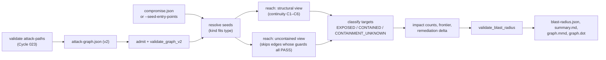

# Cycle 024 — Blueprint: Blast-Radius Analysis

**Version:** v0.1 | **Date:** 2026-09-28 | **Status:** ARCHITECTURE APPROVED  
**Approval:** APPROVED 2026-09-28 (Product Owner), with the recommended option for BQ-1 to BQ-5  
**Source of truth:** `DESIGN.md` (v0.2, approved) and `APPROVAL.md`  
**Base:** `main @ d125081`

`TASKS.md`, `dare-dag.yaml` and `EXECUTION/` are produced by `/dare-tasks` after this
Blueprint is approved.

> **Five Review items (§12, BQ-1 to BQ-5).** Writing the algorithm down exactly showed
> where the Design's wording needs a precise rule:
> - the witness tie-break;
> - containment under bounds, which needs a third state;
> - the search-state key;
> - cross-tenant targets for a seed with no tenant;
> - the exit code when every target is contained.

---

## 1. Architecture overview

### 1.1 Flow



### 1.2 Architectural decisions

| # | Decision | Justification |
|---|---|---|
| AD-01 | New crate `crates/dare-blast-radius`. Its only DARE dependency is `dare-attack-graph` (Q1 a) | Reach is graph analysis. It needs the v2 model and rules, not ten engine crates. A crate that cannot see an engine cannot re-judge one |
| AD-02 | The continuity rule moves to `dare_attack_graph::v2::continuity` as an incremental `Authority` state machine. `discontinuity()` is kept with the same signature and results, and `dare-attack-path::continuity` re-exports it | A path check (023) and a reach search (024) must apply the same C1–C6. Two copies would drift (R-03). The move is proven by byte-identical ATTACK-PATH-LAB outputs (O-07) |
| AD-03 | The output sweep (`sweep.rs`) and the label escaper move to `dare-attack-graph` the same way. `dare-attack-path` re-exports the sweep, and the escaper, `pub(crate)` in `render.rs` today, becomes `pub` and is renamed `escape_label` | The same markers, and the same escaping, must apply to every artifact both crates write. `dare-blast-radius` may not depend on `dare-attack-path` (APPROVAL) |
| AD-04 | File admission (symlink, size, depth) is re-implemented in-crate, in about 60 lines | `dare_attack_path::admit` is tied to artifact directories and positions, and is not reachable (AD-01). The limits are the same constants |
| AD-05 | Reach is a **breadth-first search over authority states** `(node, P, A)`, one search per seed and view. The key is the full state, not the node (BQ-3) | A node reached under one authority can lead further under another: for example, reached as a credential holder versus as plain content. Keying by node alone would drop reach that continuity allows |
| AD-06 | The uncontained view is the same search, with every edge skipped whose `edge_control` is `Decided(PASS)` | This is the Design's definition (RF-06), and it reuses `dare_attack_graph::v2::edge_control`, so containment follows the Cycle 023 control rule exactly |
| AD-07 | Witness route = the route by which the BFS first reaches the target, over adjacency sorted by `(target node id, edge id)` (BQ-1) | Deterministic and independent of input order, with no enumeration of equal-length routes. The Design's "ties by path id" would need every shortest route held in memory |
| AD-08 | Three exposure states: `EXPOSED`, `CONTAINED`, `CONTAINMENT_UNKNOWN` (BQ-2) | `CONTAINED` is claimed only when the uncontained search for that seed finished within bounds. Otherwise the honest answer is "unknown" (RS-06) |
| AD-09 | Outputs carry no wall-clock time. Every list is sorted by ids | Byte-identical re-runs (O-06), as in Cycle 023 AD-11 |
| AD-10 | No new third-party dependency | RS-04. `serde`, `serde_json`, `jsonschema`, `sha2`, `thiserror`, and `tempfile` for tests, are already locked |

---

## 2. Fixed technical stack

| Layer | Choice |
|---|---|
| Rust | edition 2021, MSRV 1.88, stable toolchain in CI |
| Crates | `dare-attack-graph` (path), `serde 1`, `serde_json 1`, `jsonschema` (workspace), `sha2` (workspace), `thiserror 2.0`; dev: `tempfile 3.14` |
| CLI | `clap` (existing), a new `Validate::BlastRadius` subcommand |
| CI | GitHub Actions, `pull_request: types: [opened]` unchanged, new job `blast-radius-2026` |

---

## 3. Folder structure

```text
crates/dare-attack-graph/src/v2/
  continuity.rs        # NEW home of C1–C6: Authority, step, discontinuity (AD-02)
  sweep.rs             # NEW home of the output sweep (AD-03)
  mod.rs               # re-exports
crates/dare-attack-graph/src/render.rs   # escape_label becomes pub (AD-03)
crates/dare-attack-path/src/continuity.rs  # `pub use dare_attack_graph::v2::continuity::*`
crates/dare-attack-path/src/sweep.rs       # `pub use dare_attack_graph::v2::sweep::*`
crates/dare-blast-radius/
  Cargo.toml
  src/lib.rs           # pub mod …; pub use analyze::{analyze, Analysis}
  src/error.rs         # BlastError, Refusal (§4.1)
  src/limits.rs        # §4.2
  src/admit.rs         # read_admitted(path, max_bytes) -> Value (AD-04)
  src/scenario.rs      # CompromiseScenario, SeedKind, resolve_seeds (§4.3, §6.1)
  src/reach.rs         # search(graph, index, seed, view, bounds, excluded) (§6.3)
  src/classify.rs      # targets per seed, exposure, frontier (§6.4–6.5)
  src/impact.rs        # ImpactCounts (§6.6)
  src/delta.rs         # remediation delta (§6.7)
  src/model.rs         # BlastRadiusDoc and nested types (§4.4)
  src/validate.rs      # validate_blast_radius(graph, doc) (§4.5)
  src/render.rs        # to_mermaid_reach, to_dot_reach (§5.3)
  src/summary.rs       # summary.md (§5.4)
  src/analyze.rs       # end to end
  tests/{manifest,scenario,reach,classify,delta,validate,scale}.rs
schemas/blast-radius/v1/compromise.schema.json
schemas/blast-radius/v1/blast-radius.schema.json
crates/dare-agent-security-cli/src/blast_radius.rs
crates/dare-agent-security-cli/tests/common/lab_runner.rs   # shared with attack_path_lab.rs (§7.1)
crates/dare-agent-security-cli/tests/blast_radius_cli.rs
crates/dare-agent-security-cli/tests/blast_radius_lab.rs
crates/dare-agent-security-cli/tests/fixtures/blast-radius-lab/BRL-NNN/{lab.json,compromise.json,expected.json}
crates/dare-agent-security-cli/tests/attack_path_goldens.rs   # O-07 (task in phase 0)
scripts/k24/{assert_no_real_credentials.py,verify_proof_citations.py}
book/{en,pt}/src/concepts/blast-radius.md
DARE/cycles/024-blast-radius-analysis/{BASELINE,REGRESSION,PROOF}.md
```

---

## 4. Data model

### 4.1 Errors (`error.rs`)

```rust
#[derive(Debug, thiserror::Error)]
pub enum BlastError {
    #[error("refused: {0}")] Refused(Refusal),   // exit 3, nothing written
    #[error("internal: {0}")] Internal(&'static str), // exit 1
}
#[derive(Debug, Clone, PartialEq, Eq)]
pub enum Refusal {
    Unreadable { file: &'static str },           // "graph" | "scenario"
    Symlink { file: &'static str },
    TooLarge { file: &'static str },             // > MAX_FILE_BYTES
    TooDeep { file: &'static str },              // > MAX_JSON_DEPTH
    InvalidDocument { file: &'static str },      // schema or serde failure
    InvalidGraph,                                // validate_graph_v2 failed
    GraphMismatch,                               // scenario.graph_id != graph.id
    NoSeeds,                                     // --seed-entry-points on a graph without entries
    UnknownSeed { seed: usize },
    AmbiguousSeed { seed: usize },               // entity_id matching two nodes (cannot occur for a model-built graph; refused, not guessed)
    SeedKindMismatch { seed: usize },
    DuplicateSeed { first: usize, second: usize },
    BoundAboveMaximum { bound: &'static str },
    BoundZero { bound: &'static str },
    UnsafeOutputDir,
    UnsafeArtifact { file: &'static str },       // the sweep refused an output (AD-03)
}
```

`Display` names positions and bound names only, never content. A test plants a string in
each input and checks that it is absent from every message (as in Cycle 023,
`no_error_message_echoes_input`).

### 4.2 Limits (`limits.rs`)

```rust
pub const MAX_FILE_BYTES: u64 = 16 * 1024 * 1024;   // graph
pub const MAX_SCENARIO_BYTES: u64 = 1024 * 1024;
pub const MAX_JSON_DEPTH: usize = 64;
pub const MAX_SEEDS: usize = 64;
pub const MAX_DEPTH: u32 = 12;           pub const DEFAULT_DEPTH: u32 = 8;
pub const MAX_STATES_PER_SEARCH: u64 = 1_000_000;
pub const MAX_STATES_TOTAL: u64 = 5_000_000;
pub const MAX_DELTA_EDGES: usize = 64;
pub struct Bounds { pub max_depth: u32, pub max_states: u64 }   // per search
impl Bounds { pub fn validate(&self) -> Result<(), Refusal> }    // 1..=MAX each
```

The CLI flags and the scenario's optional fields can only lower the bounds. The lower
value wins, and a value above its maximum is refused, never clamped.

### 4.3 Compromise scenario (`schemas/blast-radius/v1/compromise.schema.json`, `scenario.rs`)

```rust
#[serde(deny_unknown_fields)] pub struct CompromiseScenario {
    pub schema_version: String,          // const "1"
    pub scenario_id: String,             // ^[a-z0-9][a-z0-9._-]{0,95}$
    pub graph_id: String,                // ^graph:[0-9a-f]{64}$, must equal graph.id
    pub seeds: Vec<Seed>,                // 1..=64
    #[serde(default)] pub max_depth: Option<u32>,      // 1..=12
    #[serde(default)] pub max_states: Option<u64>,     // 1..=1_000_000
}
#[serde(deny_unknown_fields)] pub struct Seed {
    #[serde(default)] pub node_id: Option<String>,     // v1 node-id pattern, maxLength 400
    #[serde(default)] pub entity_id: Option<String>,   // ^[a-z0-9][a-z0-9._-]{0,95}$
    pub kind: SeedKind,
    #[serde(default)] pub note: Option<String>,        // 1..160, validate_safe_label
}
#[serde(rename_all = "SCREAMING_SNAKE_CASE")]
pub enum SeedKind { PrincipalTakeover, CredentialLeak, ContentInjection, ComponentCompromise }
```

- Exactly one of `node_id` / `entity_id`, enforced by the schema (`oneOf`) and by code.
- `entity_id` resolves to the unique node whose id is `node:<slug>:<entity_id>` for some
  slug. Run-scoped ids have more segments, so they never match. Zero matches is
  `UnknownSeed`; two matches is `AmbiguousSeed`.

**Kind fits type** (anything else is `SeedKindMismatch`):

| Kind | Node types |
|---|---|
| `PRINCIPAL_TAKEOVER` | HUMAN, AGENT, IDENTITY |
| `CREDENTIAL_LEAK` | CREDENTIAL |
| `CONTENT_INJECTION` | DATA |
| `COMPONENT_COMPROMISE` | TOOL, MCP_SERVER, CAPABILITY, DOWNSTREAM_SERVICE |

**Seeds from entry points** (`--seed-entry-points`). Each designation in
`graph.entry_points` becomes a seed. The kind follows the class:
- `LOW_PRIVILEGE_PRINCIPAL`, `PEER_AGENT` → `PRINCIPAL_TAKEOVER`;
- `UNTRUSTED_INPUT`, `EXTERNAL_CONTENT`, `RETRIEVED_DOCUMENT`, `MEMORY_WRITE` →
  `CONTENT_INJECTION`;
- `SUPPLY_CHAIN_COMPONENT` → `COMPONENT_COMPROMISE`.

A node designated under two classes that map to different kinds becomes two seeds. If
the kind does not fit the node's type (for example a `PEER_AGENT` entry on a DATA node),
that designation is skipped and counted in `seeds_skipped`, not refused: the graph is
valid, and only this mapping cannot apply. The pseudo-scenario id is `entry-points`, and
there are at most 64 seeds, taken in `(node id, kind)` order. The number left out is
reported in `seeds_omitted`.

### 4.4 Output document (`schemas/blast-radius/v1/blast-radius.schema.json`, `model.rs`)

Every struct is `deny_unknown_fields`. Enums are `SCREAMING_SNAKE_CASE`.

```rust
pub struct BlastRadiusDoc {
    pub schema_id: String,        // https://darelabs.tech/schemas/blast-radius/v1/blast-radius.schema.json
    pub schema_version: String,   // "1.0.0"
    pub graph_id: String,
    pub scenario_id: String,      // or "entry-points"
    pub scenario_digest: Option<String>,   // sha256:<hex> of the canonical scenario; None in entry-points mode
    pub bounds: DocBounds,        // max_depth, max_states, max_states_total, max_delta_edges
    pub seeds: Vec<SeedReport>,   // sorted by (node, kind)
    pub seeds_skipped: u32, pub seeds_omitted: u32,
    pub totals: Totals,
    pub frontier: Vec<FrontierEdge>,        // sorted by edge id
    pub remediation_delta: Vec<DeltaEdge>,  // sorted by (-targets_contained_if_held, edge id)
    pub truncated: bool,          // any search truncated, or the total budget ran out
    pub stopped_by: Vec<StopBound>,         // MAX_DEPTH_CUT is not a stop; see SearchReport
}
pub struct SeedReport {
    pub node: String, pub kind: SeedKind, pub tenant: Option<String>,
    pub structural: SearchReport, pub uncontained: SearchReport,
    pub targets: Vec<TargetReach>,          // sorted by (node, class)
    pub impact: ViewImpact,                 // { structural: ImpactCounts, uncontained: ImpactCounts }
}
pub struct SearchReport {
    pub states_explored: u64, pub nodes_reached: u32,
    pub refused_steps: u64,                 // out-edges no continuity rule explains
    pub held_edges_skipped: u64,            // uncontained view only; 0 in structural
    pub depth_cut: bool,                    // a state at max_depth had out-edges
    pub truncated: bool, pub stopped_by: Option<StopBound>,   // MAX_STATES | MAX_STATES_TOTAL
}
pub enum Exposure { Exposed, Contained, ContainmentUnknown }
pub struct TargetReach {
    pub node: String, pub class: TargetClass, pub exposure: Exposure,
    pub structural_route: Route,
    pub uncontained_route: Option<Route>,   // Some iff Exposed
    pub frontier: Vec<String>,              // held edge ids on structural_route; non-empty iff Contained
}
pub struct Route {
    pub nodes: Vec<String>, pub edges: Vec<String>,
    pub control_state: ControlState,        // dare_attack_graph::v2::path_control
    pub failed_guards: Vec<GuardRef>, pub undecided_edges: Vec<String>,
}
pub struct ImpactCounts {
    pub targets_by_class: BTreeMap<TargetClass, u32>,
    pub tenants_reached: Vec<String>,                 // tenants of reached nodes other than the seed's
    pub trust_boundaries_crossed: Vec<String>,        // union over the view's witness-route edges
    pub privileged_credentials_acquired: Vec<String>, // privileged CREDENTIAL nodes that became P on a witness route
}
pub struct Totals { pub exposed: u32, pub contained: u32, pub containment_unknown: u32,
                    pub exposed_by_class: BTreeMap<TargetClass, u32> }   // over (seed, target) pairs
pub struct FrontierEdge { pub edge: String, pub properties: Vec<String>,
                          pub evidence_ids: Vec<String>, pub contained_targets: u32 }
pub struct DeltaEdge { pub edge: String, pub properties: Vec<String>,   // FAIL guards' properties
                       pub targets_contained_if_held: u32, pub partial: bool }
pub enum StopBound { MaxStates, MaxStatesTotal }
```

### 4.5 Document invariants (`validate.rs`, `validate_blast_radius(graph, doc)`)

1. `graph_id == graph.id`; schema id and version are constant.
2. Every node and edge id in any route, frontier or delta exists in the graph. Every route
   is a walk: `edges[i]` goes from `nodes[i]` to `nodes[i+1]`. Every route starts at its
   seed.
3. Every route passes the continuity check from its seed's initial authority (§6.2). No
   step is unexplained (O-04).
4. `control_state`, `failed_guards` and `undecided_edges` equal
   `dare_attack_graph::v2::path_control` recomputed over the route.
5. An `uncontained_route` contains no edge whose `edge_control` is `Decided(PASS)`.
6. `Exposed` holds exactly when an `uncontained_route` is present. `Contained` requires
   three things: no uncontained route, the seed's uncontained search not truncated, and
   a non-empty `frontier`. `ContainmentUnknown` requires that the uncontained search was
   truncated.
7. `frontier` edge ids are exactly the edges of `structural_route` whose control is
   `Decided(PASS)`.
8. Totals and counts equal the recomputation from `seeds`. The top-level `truncated` is
   the OR of every search.
9. Lists are sorted as in §4.4 and free of duplicates.

The CLI calls it before writing, and a failure is `Internal` (exit 1). The lab calls it
on every output.

---

## 5. Contracts

### 5.1 CLI: `dare-agent-security validate blast-radius`

| Flag | Type | Rule |
|---|---|---|
| `--graph <FILE>` | path, required | admitted (§4.2), then `validate_graph_v2` |
| `--compromise <FILE>` | path | exactly one of this or `--seed-entry-points` (clap `ArgGroup`, required) |
| `--seed-entry-points` | bool | as above |
| `--output-dir <DIR>` | path, required | `ci_output::validate_output_dir` (as Cycle 023) |
| `--max-depth <N>` | u32, default 8 | 1..=12; lowers the scenario value |
| `--max-states <N>` | u64, default 1 000 000 | 1..=1 000 000 per search |
| `--json` | bool | also print `blast-radius.json` to stdout |

- **Files written, all or none:** `blast-radius.json`, `summary.md`, `graph.mmd`,
  `graph.dot`. Each is rendered and swept (AD-03) before the first write.
- **Exit codes:**
  - 0 when no target is `EXPOSED` and nothing was truncated;
  - 2 when any target is `EXPOSED`, or any search was truncated (BQ-5);
  - 3 on any `Refusal`, with nothing written;
  - 1 on `Internal`.
- **Stdout line:** `<n> seeds: <e> EXPOSED, <c> CONTAINED, <u> CONTAINMENT_UNKNOWN targets[, truncated]`.
- **`after_help`:** states the exit codes and the not-covered claims (§5.4).

**Example** (APL-016's graph, the inbound token leaked):

```json
{"schema_version":"1","scenario_id":"inbound-token-leak","graph_id":"graph:<64 hex>",
 "seeds":[{"entity_id":"inbound-token","kind":"CREDENTIAL_LEAK"}]}
```

Result:
- `node:credential:mcp-auth:<run>:cred-upstream` is `PRIVILEGED_CREDENTIAL`, `EXPOSED`;
- its uncontained route is inbound-token → MCP server → upstream credential,
  `CONTROL_FAILED` on `MCP.AUTH.CREDENTIAL_SEPARATION`;
- exit 2.

### 5.2 Library (`dare-blast-radius`)

```rust
pub enum Seeding<'a> { Scenario(&'a Path), EntryPoints }
pub struct Options { pub max_depth: Option<u32>, pub max_states: Option<u64> }
pub struct Analysis { pub doc: BlastRadiusDoc, pub graph: AttackGraphV2 }
/// Admit, validate, resolve, search, classify, count, validate the document.
/// Errors: every `Refusal` of §4.1; `Internal` when the produced document fails §4.5.
pub fn analyze(graph: &Path, seeding: Seeding<'_>, options: &Options) -> Result<Analysis, BlastError>;
```

- **Pre-conditions:** none on the file system beyond readability.
- **Post-conditions:** nothing is written by the library. The document passes
  `validate_blast_radius`.
- `analyze` is pure: the same inputs give an identical document.

`dare_attack_graph::v2::continuity` (AD-02):

```rust
#[derive(Debug, Clone, PartialEq, Eq, PartialOrd, Ord, Hash)]
pub struct Authority { pub principal: Option<String>, pub actors: BTreeSet<String> }
impl Authority {
    pub fn for_entry(entry: &NodeV2) -> Self;     // 023 initial state
    pub fn acting(node: &str) -> Self;            // P = node, A = {node}
    pub fn unset() -> Self;                       // P unset, A = {}
    pub fn component(node: &str) -> Self;         // P unset, A = {node}
    /// Applies C1–C6 to `edge`; false (state unchanged) when no rule explains it.
    pub fn step(&mut self, edge: &EdgeV2, node_type: impl Fn(&str) -> Option<NodeType>) -> bool;
}
pub fn discontinuity(entry: &NodeV2, edges: &[&EdgeV2], node_type: impl Fn(&str) -> Option<NodeType>) -> Option<u32>;
pub const MUTATION_PROPERTIES: [&str; 3];
```

`discontinuity` becomes `Authority::for_entry` plus `step` in a loop. Its six unit tests
move with it, unchanged, and every C1–C6 case also gets a `step` test.

### 5.3 Views (`render.rs`)

- Only the reached subgraph is drawn: the union of every seed's structural witness
  routes.
- Node labels are `escape_label(display_name)` plus a text tag: `[seed <KIND>]`,
  `[exposed]`, `[contained]` or `[unknown]`. A node exposed for one seed and contained
  for another carries both tags, in that order.
- Edge labels are the edge type, plus `held` or `FAIL <property>` in text, never colour
  alone.
- Mermaid is `flowchart LR` with positional ids `n0…` and `e0…`, as in the Cycle 023 v2
  renderer. DOT is `digraph blast_radius`.

### 5.4 Summary (`summary.md`)

The summary has the following sections:
- the title, graph id and scenario id;
- a table of seeds with kind and counts per exposure;
- the exposed targets by class;
- per seed, up to 50 targets with exposure and route length, then "N more in
  blast-radius.json";
- the frontier table, the remediation-delta table and the search record.

It always ends with **"What this does not claim"**:
- `CONTAINED` means only that every route to the target within `max_depth` crosses a
  control observed to hold in the supplied runs. It does not mean "safe".
- Unreached is not unreachable: a relationship no artifact or model line states is not in
  the graph.
- No reach was executed.
- The remediation delta counts what one edge's controls would contain if they held. It is
  not a ranking of risk.

---

## 6. Algorithms

### 6.1 Seed resolution (`scenario.rs`)

1. Admit the scenario (size ≤ 1 MiB, depth ≤ 64, no symlink).
2. Validate it against the embedded schema, then deserialize it.
3. Check that `graph_id` equals `graph.id`; otherwise `GraphMismatch`.
4. For each seed at index i, in document order:
   - resolve it to a node id (§4.3), or refuse with `UnknownSeed` or `AmbiguousSeed`;
   - check that the kind fits the node's type, or refuse with `SeedKindMismatch`;
   - refuse a repeated `(node, kind)` with `DuplicateSeed { first, second }`.
5. Sort the seeds by `(node id, kind)`.

### 6.2 Initial authority

| Kind | State |
|---|---|
| `PRINCIPAL_TAKEOVER`, `CREDENTIAL_LEAK` | `Authority::acting(seed)` |
| `CONTENT_INJECTION` | `Authority::unset()` |
| `COMPONENT_COMPROMISE` | `Authority::component(seed)` |

The seed's tenant is `node.security.tenant`.

### 6.3 Reach search (`reach.rs`)

```rust
pub enum View { Structural, Uncontained }
pub struct Found { pub reached: BTreeMap<String, RouteRef>, pub report: SearchReport }
pub fn search(graph: &Indexed, seed: &str, init: Authority, view: View, bounds: Bounds,
              budget: &mut u64 /* total */, excluded: Option<&str> /* delta edge */) -> Found;
```

- **Index.** Built once. `out[node]` holds the edges sorted by `(target id, edge id)`,
  and `node_type[id]` gives each node's type.
- **Queue.** A FIFO of state ids. A state is `(node, Authority, depth, parent state,
  via edge)`, and states live in an arena `Vec`. `visited` is a
  `HashSet<(node, Authority)>`. Output never depends on its iteration order: only
  membership is tested.
- **Start.** The seed's state is at depth 0.
- **Pop a state `s`.** If `depth == max_depth` and `out[node]` is non-empty, set
  `depth_cut` and continue. Otherwise, for each edge `e` in `out[node]`, in order:
  1. if `Some(e.id) == excluded`, skip it;
  2. in the uncontained view, if `edge_control(e) == Decided(Pass)`, count
     `held_edges_skipped` and skip it;
  3. clone the authority and call `step(e)`; if it returns false, count `refused_steps`
     and skip it;
  4. if `(e.target, authority')` is in `visited`, skip it;
  5. if `states_explored == max_states`, set `truncated` with `MaxStates` and stop;
     if `*budget == 0`, set `truncated` with `MaxStatesTotal` and stop;
  6. push the new state, `states_explored += 1`, `*budget -= 1`;
  7. if `e.target` is not yet in `reached`, record `reached[e.target]` pointing to this
     state. This is the witness (AD-07).
- **No self-reach.** The seed itself is never in `reached`, and a route never revisits a
  node: `step` is attempted only when `e.target` is not already on the parent chain.
  The check walks the chain, which is at most 12 deep.
- **Complexity.** O(states × out-degree), bounded by `max_states`.

### 6.4 Targets and exposure (`classify.rs`)

The candidate targets of a seed are two sets:
- every `graph.targets` designation `(node, class)` whose node is not the seed;
- every RESOURCE or DATA node whose tenant is set and differs from the seed's tenant,
  with class `CROSS_TENANT_RESOURCE`. A seed without a tenant has none (BQ-4, as Cycle
  023 R-9).

Each candidate present in the structural view's `reached` becomes a `TargetReach`:

| Condition | Exposure |
|---|---|
| present in the uncontained `reached` | `Exposed`, with `uncontained_route` = its witness |
| absent there, and the uncontained search was not truncated | `Contained` |
| absent there, and the uncontained search was truncated | `ContainmentUnknown` |

- `structural_route` is the structural witness.
- `frontier` is the set of edges on `structural_route` with `Decided(PASS)`. It is
  non-empty for `Contained`, because the structural witness must cross a held edge,
  otherwise the uncontained search would have taken the same route. A test asserts this
  consequence.
- Routes are built by walking parents to the seed. Their control fields come from
  `path_control`.

### 6.5 Frontier (top level)

For every held edge that appears in any `Contained` target's `frontier`, the report
gives:
- the properties of its guards, deduplicated and sorted;
- their evidence ids;
- `contained_targets`, the number of `(seed, target)` pairs that list the edge.

### 6.6 Impact (`impact.rs`)

Per seed and view, over the targets reached in that view (the structural view counts
every reached target, the uncontained view only `Exposed` ones):
- `targets_by_class`;
- `tenants_reached`: distinct tenants of every reached node, not only targets, other than
  the seed's;
- `trust_boundaries_crossed`: the union of `crosses_trust_boundary` over the edges of the
  view's witness routes to reached targets;
- `privileged_credentials_acquired`: the privileged CREDENTIAL nodes that are the
  principal P at some state on a witness route.

### 6.7 Remediation delta (`delta.rs`, RF-10, SHOULD)

1. **Candidates.** Collect every edge that meets both conditions:
   - its `edge_control` is `Decided(FAIL)`;
   - it lies on the `uncontained_route` of some `Exposed` target.

   Order them by the smallest index at which they occur on such a route, then by edge
   id, and keep the first `MAX_DELTA_EDGES`.
2. **Recount.** For each candidate and each seed that has it on an exposed route, run the
   uncontained search again with `excluded = Some(edge)`. Count the exposed targets of
   that seed that are no longer reached.
3. **Partial.** A recount whose search was truncated marks the entry `partial: true`. It
   still counts only targets that were definitely no longer reached.
4. **Budget.** All recounts draw from the shared `MAX_STATES_TOTAL` budget. When it is
   exhausted, the remaining candidates are listed with `partial: true` and 0.

### 6.8 Determinism

The following never depend on input order, on hash-map order or on the clock:
- seed order;
- adjacency order;
- queue discipline;
- the arena;
- the output sort keys.

A test shuffles the graph's `nodes` and `edges` arrays 10 times. It re-seals the graph
id and compares the documents, after mapping the graph id (O-06).

---

## 7. Test plan

### 7.1 BLAST-RADIUS-LAB (`crates/dare-agent-security-cli/tests/blast_radius_lab.rs`)

The graphs come from ATTACK-PATH-LAB. `lab.json` names `"graph_from": "APL-NNN"`. The
harness runs that APL scenario's engine runs and system model through the real binary
(`tests/common/lab_runner.rs`, extracted from `attack_path_lab.rs` with no behaviour
change). It then writes `compromise.json`, substituting `${graph_id}` and `${run:N}`, and
runs `validate blast-radius` twice. The two outputs must be byte-identical.
`expected.json` gives the following:
- per seed, the targets with class, exposure, route nodes, control state and failed
  properties, and frontier properties;
- `absent` targets;
- `refused_steps_min`;
- `delta` entries;
- `truncated`, and `exit`.

| Range | Graph | Class |
|---|---|---|
| BRL-001..002 | APL-016 / APL-017 | inbound token leaked → upstream credential and MCP resource. Attack: `EXPOSED` on credential separation. Control: `CONTAINED`, frontier `MCP.AUTH.CREDENTIAL_SEPARATION` |
| BRL-003..004 | APL-001 / APL-002 | index-admin credential leaked → the resource it can reach |
| BRL-005..006 | APL-009 / APL-010 | planner peer taken over → assistant → service identity → credential |
| BRL-007..008 | APL-005 / APL-006 | alice taken over → cross-tenant memory, credential |
| BRL-009..011 | APL-001, APL-002, APL-005 | uploaded document or tenant-B memory injected → acting principal → targets |
| BRL-012..013 | APL-013 / APL-014 | left-pad package compromised → build → assistant → credential |
| BRL-014 | APL-019 / APL-020 | user channel injected → assistant → payments transfer. The APL-020 graph gives `CONTAINED` |
| BRL-015..016 | APL-020, APL-017 | containment twins with the delta: the failing edge's delta count equals the targets the twin contains |
| BRL-017..018 | APL-022 / APL-023 | a declared access under a principal never acquired is refused (`refused_steps` ≥ 1) and its target is absent |
| BRL-019 | APL-001 | `--seed-entry-points` |
| BRL-020 | APL-005 | `max_states: 3` → `truncated`, `CONTAINMENT_UNKNOWN`, exit 2 |

**Class contract.** Every attack class has a control twin. Every `EXPOSED` expectation
with `CONTROL_FAILED` names its property. Every `CONTAINED` expectation names its
frontier properties.

### 7.2 Unit and property tests (`dare-blast-radius/tests/`)

- **`scenario.rs`:** one test per refusal of §4.1 that concerns scenarios; entity
  resolution; the kind-fits-type table in full (every kind × every node type); the
  entry-point mapping, including a skipped designation.
- **`reach.rs`:**
  - initial states per kind;
  - a C1–C6 case per rule inside a search;
  - `refused_steps` counted;
  - no revisit on cycles and self-loops;
  - `depth_cut`;
  - `MaxStates` and `MaxStatesTotal`;
  - the witness tie-break;
  - the uncontained view skipping exactly `Decided(PASS)` edges, while structural edges,
    `INCONCLUSIVE`, unassessed and `FAIL` edges stay traversable.
- **`classify.rs`:**
  - every exposure state;
  - cross-tenant candidates, and none for a seed without a tenant;
  - a property test on random graphs (fixed-seed LCG, 200 graphs of 30 nodes): every
    `Contained` target has no uncontained route found by an independent exhaustive
    enumeration within `max_depth` (O-03).
- **`delta.rs`:** the delta equals the recount by hand on two small graphs; `partial`
  under a budget.
- **`validate.rs`:** one test per invariant of §4.5, each with a doctored document.
- **`scale.rs`:** 2 000 nodes, 10 000 edges and 64 seeds in both views under 10 s in
  release (O-08). CI runs it with `--release`.
- **`manifest.rs`:**
  - dependencies are only those of §2;
  - no crate other than the CLI depends on `dare-blast-radius`;
  - the source has no `std::net`, `std::process` or `std::thread`.

### 7.3 Compatibility (O-07)

- **`attack_path_goldens.rs`.** For all 26 ATTACK-PATH-LAB scenarios, the SHA-256 of
  each of the six output files equals the digest recorded in `BASELINE.md` before the
  continuity move. Engine versions and the `unrecorded` commit do not change within the
  cycle, so the digests are stable.
- **Cycle 023 compatibility tests pass unchanged:**
  - `v1_output_is_byte_identical_to_the_baseline`;
  - `the_engine_crates_are_unchanged`;
  - `the_registries_and_every_profile_are_unchanged`;
  - `a_v2_path_is_eligible_exactly_when_the_v1_path_with_its_id_is`.
- **`dare-attack-path` behaviour stays the same:** the `discontinuity` unit tests and
  `paths.rs` pass unchanged.

### 7.4 CLI (`blast_radius_cli.rs`)

- exit 0, 1, 2 and 3 are each covered;
- the refusal corpus: every `Refusal`, nothing written, no echo;
- the help offers no flag beyond §5.1;
- hostile display names are escaped in both views;
- identical bytes across two runs.

---

## 8. Execution plan (phases)

| Phase | Name | Goal | DONE criterion (verifiable) | Deliverables |
|---|---|---|---|---|
| 0 | Baseline and container | Measured start | `BASELINE.md` records: `d125081`; test totals; 23 members; the SHA-256 of every ATTACK-PATH-LAB output file (26 × 6); the v1 golden digests; the last green `Action E2E` on `main` or a builder-stage build. `attack_path_goldens.rs` asserts the 156 digests | `BASELINE.md`, `attack_path_goldens.rs` |
| 1 | Shared rules move | One continuity and one sweep | `dare_attack_graph::v2::{continuity, sweep}` exist, and `escape_label` is `pub`. `dare-attack-path` re-exports them. `attack_path_goldens.rs`, `attack_path_lab`, the `paths.rs` suite and the Cycle 023 compatibility tests pass unchanged | `v2/continuity.rs`, `v2/sweep.rs`, re-exports |
| 2 | Crate skeleton | Containment first | The crate is a workspace member with §2 dependencies only. `manifest.rs` passes. `limits.rs` and `error.rs` have one test per bound and `no_error_message_echoes_input` | `Cargo.toml`, `lib.rs`, `error.rs`, `limits.rs`, `admit.rs` |
| 3 | Schemas and seeds | Closed inputs | Both schemas compile, with `additionalProperties: false` throughout. `scenario.rs` passes every §6.1 rule and the full kind × type table | `schemas/blast-radius/v1/*`, `scenario.rs` |
| 4 | Reach engine | Continuity-respecting reach | The `reach.rs` tests pass, including the uncontained edge rule and both bounds | `reach.rs` |
| 5 | Classification, impact, delta, document | The analysis | The `classify.rs` property test finds 0 false containment. The `delta.rs` and `validate.rs` tests pass, one per §4.5 invariant. `analyze` is deterministic under 10 shuffles | `classify.rs`, `impact.rs`, `delta.rs`, `model.rs`, `validate.rs`, `analyze.rs` |
| 6 | CLI, views, summary | End to end | The `blast_radius_cli.rs` tests pass: exit codes 0, 1, 2 and 3; refusals write nothing; views escape; the summary carries the not-claimed text | `blast_radius.rs`, `render.rs`, `summary.rs` |
| 7 | BLAST-RADIUS-LAB | Ground truth | BRL-001..020 pass with the class contract and byte-identical double runs. `attack_path_lab` still passes on the shared runner | lab fixtures, `blast_radius_lab.rs`, `tests/common/lab_runner.rs` |
| 8 | CI | Gate | Job `blast-radius-2026`: lab, CLI, the crate's tests, `scale.rs` in release, ATTACK-PATH goldens. A `ci.yml` test asserts no secrets and no URL | `ci.yml`, `tests/ci_job.rs` |
| 9 | Security and dependency audit (N-1) | Frozen boundaries proven | `cargo audit` is clean and the lockfile adds no third-party package. `scripts/k24/assert_no_real_credentials.py` is clean. The builder-stage image builds, and the in-image binary exits 3 on a doctored graph with networking disabled | `REGRESSION.md`, `scripts/k24/*` |
| 10 | Docs and proof | EN/PT docs, PROOF | The concept page exists in EN and PT, linked from both `SUMMARY.md` files, with the not-claimed text. `PROOF.md` maps every Design item to an executed test. `verify_proof_citations.py` passes. Both mdBook builds are green. The archive branch `agent/cycle-024-blast-radius-analysis` is pushed | `book/*`, `PROOF.md`, `REGRESSION.md` |

**Dependencies:**
- 0 → 1 → 2 → 3 → 4 → 5 → 6 → 7 → 8 → 9 → 10;
- 7 also needs 1 (the shared runner);
- 10's docs may start after 6.

---

## 9. Validation gates (Rust)

| Step | Command |
|---|---|
| Format | `cargo fmt --all --check` |
| Build and lint | `cargo clippy --workspace --all-targets -- -D warnings` |
| Test | `cargo test --workspace` |
| Scale | `cargo test -p dare-blast-radius --release --test scale` |
| Audit | `cargo audit` (no HIGH or CRITICAL) |
| Container | builder-stage `docker build`, plus `action-e2e.yml` on the PR |
| Cycle job | `python scripts/run-ci-job-locally.py .github/workflows/ci.yml blast-radius-2026` |

---

## 10. Security controls

| RS | Control | Phase |
|---|---|---|
| RS-01 | Admission (§4.2), both schemas, `validate_graph_v2`, `deny_unknown_fields` | 2, 3 |
| RS-02 | `escape_label` in the views, the shared sweep before any write, position-only errors | 1, 6 |
| RS-03 | Symlink refusal, and exactly two input paths plus the output directory | 2, 6 |
| RS-04 | No new third-party dependency; `cargo audit` | 9 |
| RS-05 | No environment variable is read; a manifest and source test | 2 |
| RS-06 | Three exposure states, invariant 6, the `classify.rs` property test | 5 |
| RS-07 | No score field in either schema (a schema test lists the allowed keys) | 3 |
| RS-08 | No `std::net`, `std::process` or `std::thread` (source scan) | 2 |
| RS-09 | Per-search and total state bounds, depth bound, reported truncation | 4 |

---

## 11. Deployment strategy

| Environment | Branch | Trigger | Infrastructure |
|---|---|---|---|
| CI | `claude/loving-newton-113zme` → PR to `main` | `pull_request: opened` | GitHub Actions `ubuntu-latest` |
| Release | `main` after human merge | existing release workflow, unchanged | GitHub Release binaries and the Action image; no new artifact type |

---

## 12. Review items (Blueprint-level)

1. **BQ-1: witness tie-break.** The Design says "ties broken by path id".
   - **Recommendation (AD-07):** the witness is the route the BFS reaches first over
     adjacency sorted by `(target id, edge id)`. It is equally deterministic and input-order
     independent, and needs no set of all shortest routes.
   - Accept?
2. **BQ-2: containment under bounds.** A target can be absent from the uncontained view
   only because that search was truncated.
   - **Recommendation:** a third state, `CONTAINMENT_UNKNOWN`, and `CONTAINED` claimed
     only within `max_depth` and with the uncontained search complete (RS-06).
   - Accept?
3. **BQ-3: search-state key.**
   - **Recommendation (AD-05):** key by `(node, P, A)` rather than by node, so that reach
     continuity allows is not dropped. The state bounds contain the growth.
   - Accept?
4. **BQ-4: cross-tenant targets for a seed without a tenant.**
   - **Recommendation:** none, as in Cycle 023 R-9. Tenants reached are still listed in
     impact.
   - Accept?
5. **BQ-5: exit code.**
   - **Recommendation:**
     - exit 2 when any target is `EXPOSED`, or any search was truncated;
     - exit 0 when every reached target is `CONTAINED` and nothing was cut. A gate should
       not fail on reach that controls observably contain.
   - Accept?

---

## 13. Approval checklist

BQ-1 to BQ-5: **DECIDED (2026-09-28): accepted as recommended.**


- [x] Architecture decisions AD-01 to AD-10 accepted, including the shared-rule move (AD-02, AD-03)
- [x] Scenario and output schemas (§4.3, §4.4) and invariants (§4.5) accepted
- [x] Reach algorithm (§6.3) and exposure rule (§6.4) accepted
- [x] Remediation delta (§6.7) accepted as SHOULD
- [x] BLAST-RADIUS-LAB (§7.1) and compatibility goldens (§7.3) accepted
- [x] Phases and DONE criteria (§8) accepted
- [x] BQ-1 to BQ-5 answered
